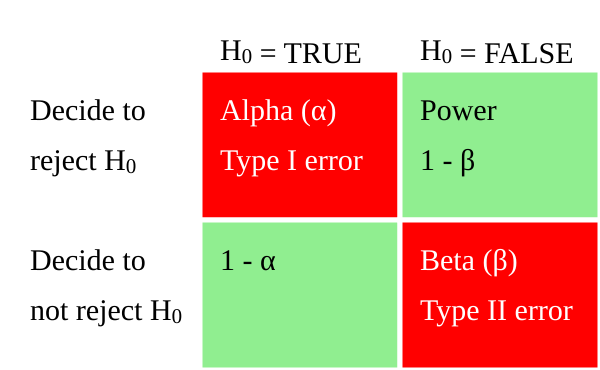
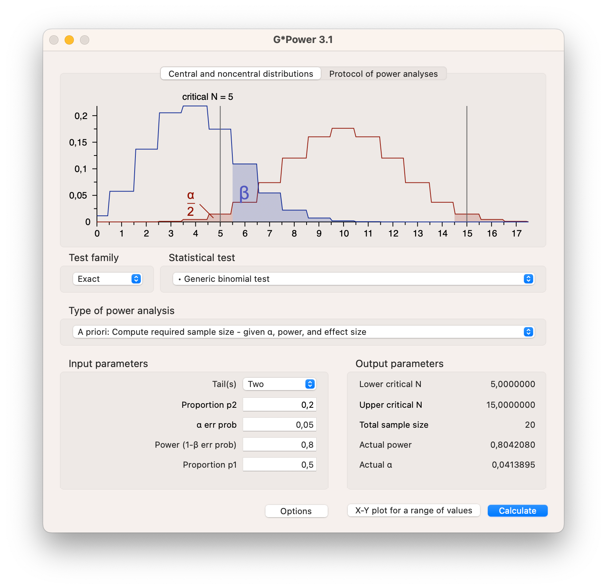

```{r setup, include=FALSE}
source("R_setup.R")
```

# Hypothesis testing {#sec-hypothesis}

> Key concepts: research hypothesis, statistical null and alternative hypothesis, nil hypothesis, test statistic, _p_ value, conditional probability, alpha, significance level (Type I error rate), Type I error, inflated type I error, type II error, Power, critical value, capitalization on chance, one-sided and two-sided tests and tests to which this distinction does not apply, rejection region, Bayesion statistics, confidence intervals.  

### Summary {-}

In the preceding chapter, we have learned that a confidence interval contains the population values that are plausible, given the sample that we have drawn. In the current chapter, we apply our knowledge of sampling distributions, probability models and parameter estimation to hypothesis testing. 

This chapter explores various methods for testing hypotheses. While we primarily focus on the widely used null hypothesis significance testing (NHST), we also discuss how confidence intervals and Bayesian statistics can aid in making decisions about hypotheses.

We will first extensively cover the framework of null hypothesis significance testing (NHST). @sec-null-hypothesis-significance-testing covers key concepts such as the null and alternative hypotheses, significance level (alpha), power of a test, p-values, and effect sizes. The section also discusses one-sided and two-sided tests and the importance of sample size in determining the power of a test.

In @sec-reporting we offer guidelines for reporting statistical test results. It emphasizes clarity and transparency in presenting findings to different audiences, including fellow scientists and general readers. The section covers the necessary components of a statistical report, such as test statistics, p-values, effect sizes, and confidence intervals.

@sec-test-selection on Statistical Test Selection guides the selection of appropriate statistical tests based on the data and research questions. It provides a framework for choosing tests by considering factors such as the type of data, the number of groups being compared, and the study design. The section includes flowcharts and examples to illustrate the decision-making process.

We continue with a discussion of confidence intervals as an alternative to hypothesis testing in @sec-null-ci. It explains how confidence intervals provide a range of plausible values for population parameters and how they can be used to make inferences about hypotheses. The section also discusses bootstrapped confidence intervals and their application.

We follow up with Bayesian hypothesis testing, contrasting it with frequentist methods. We explain the Bayesian approach of updating prior beliefs with data to obtain posterior probabilities. The section (@sec-bayesian-hypothesis-testing) covers the concepts of prior, likelihood, and posterior distributions, and how they are used to make decisions about hypotheses.

In the final section (@sec-critical-discussion) we critically examine the limitations and criticisms of null hypothesis significance testing. We discuss issues such as the misinterpretation of p-values, the overemphasis on statistical significance over practical significance, and the risks of data dredging and publication bias. The section advocates for a more nuanced understanding and reporting of statistical results.

## Hypothesis {#sec-binarydecision}

The assumption that a researcher wants to test is called a _research hypothesis_. It is a statement about the empirical world that can be tested against data. Communication scientists, for instance, may hypothesize that:

* a television station reaches half of all households in a country,
* media literacy is below a particular standard (for instance, 5.5 on a 10-point scale) among children, 
* opinions about immigrants are not equally polarized among young and old voters,  
* the celebrity endorsing a fundraising campaign makes a difference to adult's willingness to donate,  
* more exposure to brand advertisements increases brand awareness among consumers,
* and so on.  

These are statements about populations: all households in a country, children, voters, adults, and consumers. As these examples illustrate, research hypotheses seldom refer to statistics such as means, proportions, variances, or correlations. Still, we need a statistic to test a hypothesis. The researcher must translate the research hypothesis into a new hypothesis that refers to a statistic in the population, for example, the population mean. The new hypothesis is called a statistical hypothesis.

A statistical hypothesis is a statement about the empirical world that can be tested against data. It is a statement about the population, not the sample. For example, a hypothesis could be that the average age of a population is 30 years, that the average weight of candy bags is 500 grams, that the proportion of people that like a certain brand is .5, or that the correlation between two variables is .3. These are all statements about the population, not the sample. 

Scientists test these hypotheses by following the _empirical cycle_ [@deGrootMethodologyFoundationsInference1969], which involves a systematic process of induction, deduction, testing, and evaluation. Based on the results, hypotheses can be either rejected or not rejected. If the hypothesis is based on theory and previous research, the scientist uses previous knowledge. As a next step, the researcher tests the hypothesis against data collected for this purpose. If the data contradict the hypothesis, the hypothesis is rejected and the researcher has to improve the theory. If the data does not contradict the hypothesis, it is not rejected and, for the time being, the researcher does not have to change the theory.  

Statistical hypotheses usually come in pairs: a null hypothesis (_H_~0~) and an _alternative hypothesis_ (_H_~1~ / _H_~A~). We met the null hypothesis in the preceding sections. We use it to create a (hypothetical) sampling distribution. To this end, a null hypothesis must specify one value for the population statistic that we are interested in, for example, .5 as the proportion of yellow candies.

### Null hypothesis

The null hypothesis reflects the skeptical stance in research. It assumes that there is nothing going on. There is no difference between different experimental conditions or groups, the new intervention is not better than the previous, there is no correlation between variables, there is no predictive value to your regression model, a coin is fair, and so forth. @eq-Hnull shows some examples of null hypotheses expressed in test statistics.

$$
\begin{eqnarray*}
H_{0} & : \theta & = .5 \\
H_{0} & : \mu & = 100 \\
H_{0} & : t & = 0 \\
H_{0} & : \mu_1 & = \mu_2 \\
\end{eqnarray*}
$$ {#eq-Hnull}
The null hypothesis does not always assume that the population parameter is zero; it can take any specified value. For instance, a null hypothesis might state that there is no difference in intelligence between communication science students and the general population. In this case, we could test whether the average intelligence score of a sample of communication science students is different from 100, the average intelligence score known from extensive prior work (population parameter = 100). Alternatively, we could test whether the difference between the intelligence scores of a sample of communication science students and a sample of the general population is 0 (population parameter = 0). These two research designs test the same hypothesis, but require different statistical tests, as you will learn in @sec-test-selection.

If we assume that the null hypothesis (a specific population parameter) is true (for instance, that the proportion of yellow candies is .5 in the population), we can make additional assumptions about what the population in question should look like and, thereby, create the so-called null distribution (a sampling distribution that reflects the true population if the the null hypothesis is correct). You have learned about three formal ways of creating such a distribution in @sec-probmodels. For instance, as illustrated in @fig-nulldistribution, if the true proportion of yellow candies in the population is .5, randomly sampling a bag in which 1 out of 10 or 10 out of 10 candies is yellow is very unlikely, while sampling a bag with 4, 5, or 6 yellow candies are likely outcomes.

```{r}
#| label: fig-nulldistribution
#| fig-cap: "Discrete binomial distribution."
#| echo: false
#| warning: false

title = expression(paste("Null distributions ", theta, " = .5"))

colh0 = 'yellow'
colha = 'lightyellow'

barplot( dbinom(0:10, 10, .5),
         main=title, 
         names.arg = 0:10, 
         xlab      = "number of yellow candies", 
         ylab      = "Probability", 
         col       = colh0
         # beside    = TRUE
         # density   = c(0, 10)
         #legend.text = c("H0", "HT")
         )

# abline(v = c(6.5,27.5), lty=2, col='red')

# legend("topright", legend=c("H0"), fill=c(colh0))

```

Null Hypothesis Significance Testing is a frequently used, structured approach for testing hypotheses using inferential statistics which we will discuss in detail in this course (see @sec-null-hypothesis-significance-testing). At this stage, it is important to note, that statistical tests in this approach are designed to assess whether the null hypothesis (and its associated null distribution) are a plausible representation of the population given the data we observe in a random sample drawn from this population. That is, the goal of most formal tests we discuss in this course is to reject or support the null hypothesis.

### Alternative hypothesis {#sec-alternative-hypothesis}

The alternative hypothesis is formulated as a companion of a specific null hypothesis. It describes an assumption about the population that contradicts the null hypothesis. Most commonly, the alternative hypothesis describes what the researcher expects to find if their theory is accurate. It is usually expressed in form of an effect (for instance, differences or deviation from null). If the theory is accurate, the expected effect would indeed reflect the true population value. 

When we do research, we do not know the true population value. If we did, no research would be needed. What we do have is theories, previous research, knowledge about what happened to a population (for instance, it was exposed to a public health campaign). Based on this, we can make an educated guess about the true population value. This educated guess is expressed as the alternative hypothesis. 

Lets revisit the case of our candy factory and assume that the machine produces candy bags in which, on average, 2 out of every 10 candies are yellow. In other words, the population parameter is .2. Again, based on this alternative hypothesis, we can generate a probability distribution called the alternative disribution that describes the population accurately under the assumption that the alternative hypothesis (and not the null hypotheiss) it true (@fig-altdistribution). In this case, the most likely outcome of randomly sampling a candy bag from this population is finding 2 yellow candies in a bag, while finding 9 or 10 yellow candies is very unlikely.

```{r}
#| label: fig-altdistribution
#| fig-cap: "Discrete alternative binomial distribution."
#| echo: false
#| warning: false

title = expression(paste("Alternative distribution ", theta, " = .2"))

colh0 = 'yellow'
colha = 'lightyellow'

barplot( dbinom(0:10, 10, .2),
         main=title, 
         names.arg = 0:10, 
         xlab      = "number of yellow candies", 
         ylab      = "Probability", 
         col       = colha
         # beside    = TRUE
         # density   = c(0, 10)
         #legend.text = c("H0", "HT")
         )

# abline(v = c(6.5,27.5), lty=2, col='red')

# legend("topright", legend=c("H0"), fill=c(colh0))

```

Note that the probability distribution for $H_0$ indicates the null assumption (for instance, that there is no effect), while the probability distribution for $H_A$ is based on the assumed population value. Both distributions are based on assumptions and some specifics of our research design which we will discuss later in this chapter. They are not based on any actual research data.

In specifying the alternative hypothesis, a companion to your null hypothesis, you have different options about how specific you want to be, depending on your theory. An alternative hypothesis can stipulate that the true population parameter is simply not equal to the null hypothesis. This is called a two-sided alternative hypothesis in which you don't specify whether the expected population value is greater or smaller than what is specified in the null hypothesis. You also have the option of formulating a one-sided alternative hypothesis that explicitly specifies whether the expected population value is greater than or smaller than the null hypothesis. @eq-Halt shows some examples of alternative hypotheses expressed in test statistics.

$$ 
\begin{eqnarray*}
\text{Two-sided} \\
H_{A} & : \theta & \neq .5 \\
H_{A} & : t & \neq 0 \\
H_{A} & : \mu_1 & \neq \mu_2 \\
\text{One-sided} \\
H_{A} & : \theta & < .5 \\
H_{A} & : t & > 0 \\
H_{A} & : \mu_1 & < \mu_2 \\
\end{eqnarray*}
$$ {#eq-Halt}
The choice between a one-sided and two-sided hypothesis (and corresponding statistical test) depends on the research question and the theory. We will cover one and two-sided testing more extensively in @sec-one-twosidedtests.

### Testing hypotheses

In the empirical cycle, the researcher tests a hypothesis against data collected for this purpose. The most widely used method for testing hypotheses is null hypothesis significance testing (NHST). As we will read in this chapter, there are other methods that can be used to test hypotheses, such as confidence intervals and Bayesian statistics. 

All methods serve as decision frameworks that enable researchers to establish rules for evaluating their hypotheses. These rules are determined before data collection and are designed to minimize the risk of incorrect decisions. Null Hypothesis Significance Testing (NHST) manages this risk by defining it probabilistically. Confidence intervals provide a measure of precision through their width, while Bayesian statistics express this risk in terms of the credibility interval.

In the next chapters, we will cover the logic behind NHST, confidence intervals, and Bayesian statistics. We will also discuss how to select the appropriate statistical test for your research question, and how to report the results of your statistical tests.

## Null Hypothesis Significance Testing {#sec-null-hypothesis-significance-testing}

Null Hypothesis Significance Testing (NHST) is the most widely used method for statistical inference in the social sciences and beyond. The logic underlying NHST is called the Neyman-Pearson approach [@RefWorks:3930]. Though these names are not widely known, the work of Jerzy Neyman (1894–1981) and Egon Pearson (1895–1980) still has a profound impact on the way research is conducted, reviews are considered, and papers are published.

The Neyman-Pearson approach ensures tight control on the probability of making correct and incorrect decisions. It is a decision framework that gives you a clear criterion for deciding whether to accept or reject the null hypothesis and also an indication of what the probability is that your decision is wrong. 

The Neyman-Pearson approach is about choosing your desired probability of making correct and incorrect decisions, setting up the right conditions for this, and making a decision. It involves the following:

1. Alpha - Determine your desired risk of drawing the wrong conclusion about the null hypothesis.
2. Power - Determine your desired probability of drawing the correct conclusion about the null hypothesis.
3. The true effect size
4. The sample size needed to achieve desired power.
5. Conduct your research with this sample size.
6. Determine the test statistic.
7. Determine if $p$-value $\leq \alpha$. If so, reject $H_0$.

The two decisions (accepting or rejecting $H_0$) can be visualized in a $2 \times 2$ table where in reality $H_0$ can be true or false, and the decision can either be to reject $H_0$ or not. @fig-decisiontable illustrates the correct and incorrect decisions that can be made. The green squares represent the two correct decisions: to reject $H_0$ when it is in fact false, and not to reject $H_0$ if it is in reality true. The red squares represent the two incorrect decisions: to reject $H_0$ when it is actually true (Type I error), or not reject $H_0$ if it is in reality false (Type II error).

{width=500 #fig-decisiontable fig-align="left"}

Intuitively it is easy to understand that you would want the probability of an incorrect decision to be low, and the probability of a correct decision to be high. But how do we actually set these probabilities? We will rely on our candy facotry example to clarify the different components of the Neyman-Pearson approach in this chapter. As a basis for this discussion, we need two distributions. First, in @sec-discreterandomvariable we learned that the factory produces candy bags where one fifth of the candies are supposed to be yellow. Based on this knowledge, we can create the true probability distribution for our population of candy bags. Second, a researcher doesn't generally know the true population value and migth pose the null hypothesis that half of the candies per bag are yellow. This leads to a second H0 distribution. In @fig-expected-value you can set the parameter values to .5 and .2 and see what the respective null distributions (discrete probability distributions) look like. @fig-twobinom shows both distributions which represent the probability of randomly sampling a candy bag containing 10 candies in total with different numbers of yellow candies under the assumption that the proportion of yellow candies per bag in the population is either .5 (H0) or .2 (the true population parameter).

:::: {.columns}

::: {.column width="50%"}

* $H_0$ Distribution
    * Half of the candies in the bag are yellow
    * The parameter of the candy machine is .5
    * With expected value 5 out of 10

:::
    
::: {.column width="50%"}    
    
* $H_T$ True distribution
    * One fifth of the candies in the bag are yellow
    * The parameter of the candy machine is .2
    * With expected value 2 out of 10

:::

::::

```{r}
#| label: fig-twobinom
#| fig-cap: "Discrete alternative binomial distributions."
#| echo: false
#| warning: false

title = "Both distributions"

colh0 = 'yellow'
colha = 'lightyellow'

barplot( rbind(dbinom(0:10, 10, .5),
               dbinom(0:10, 10, .2)), 
         main=title, 
         names.arg = 0:10, 
         xlab      = "number of yellow candies", 
         ylab      = "Probability", 
         col       = rbind(colh0,colha),
         beside    = TRUE
         # density   = c(0, 10)
         #legend.text = c("H0", "HT")
         )

# abline(v = c(6.5,27.5), lty=2, col='red')

legend("topright", legend=c("H0","HT"), fill=c(colh0, colha))

```

### Alpha {#sec-alpha}

The first step in the Neyman-Pearson approach is to set the desired type I error rate, also known as the significance level, $\alpha$. This is the probability of rejecting the null hypothesis when it is assumed to be true. In the $2 \times 2$ decision table in @fig-decisiontable, this corresponds to the top left quadrant.

As a researcher, you decide how much risk you are willing to take to make a type I error. As the Neyman-Pearson approach is a decision framework, you have to set this probability before you start collecting data. The most common value for $\alpha$ is .05, which means that you accept a 5% chance of making a type I error of rejecting the null hypothesis when it is in reality true.

In our yellow candy example, the null hypothesis was that the parameter value is .5 (5 out of 10 candies per bag are yellow). We have already determined that if $H_0$ is true, it is still possible to randomly draw a candy bag with as few as 0 or as many as 10 yellow candies. However, the probability of doing so is rather low (.002 or 0.2%) as can be seen on the y-axis of the associated probability distribution in @fig-nulldistribution and in @tbl-nullprobtable below. Imagine that while implementing the Neyman-Pearson approach, we set up a decision criterion where we plan to only reject the null hypothesis if we randomly draw a sample bag in which 0 or 10 candies are yellow. Assuming that the null hypothesis is true, this decision would be wrong, but unlikely to occur. Our type I error (also called alpha or significance level), would be .002.

```{r}
#| label: tbl-nullprobtable
#| tbl-cap: "Probabilities of drawing a certain amount of yellow candies from a bag of 10 candies, assuming the null hypothesis to be true."
#| echo: false
#| warning: false


 library("tidyverse")
 library("kableExtra")
 options(kableExtra.auto_format = FALSE)

binomprob <- data.frame(Yellow = as.character(0:10), 
                        Prob   = round(dbinom(0:10, 10, .5), 3))

names(binomprob) = c("#Y", "Pr H0")

kable(t( binomprob ),
              booktabs = TRUE ) %>% kable_styling(font_size = 10)
```

Choosing such an alpha level would result in a decision threshold located between 0 and 1 yellow candies in the sample bag and 9 and 10 yellow candies in the sample bag. We call this the **critical value** associated with the chosen alpha level. If the number of yellow candies in our sample bag is outside of this threshold (0 or 10 yellow candies) we would reject the null hypothesis. If the number of yellow candies in our sample bag is inside of the threshold (1, 2, 3, 4, 5, 6, 7, 8, or 9 yellow candies) we would not reject the null hypothesis. Amounting to a type I error rate of .002 (0.2%). @fig-nulldistributionalpha shows the critical values for the null hypothesis distribution, and indicate what the decision would be for values on the outside and inside of the decision boundary.

```{r}
#| label: fig-nulldistributionalpha
#| fig-cap: "H0 binomial distribution with critical values."
#| echo: false
#| warning: false


title = expression(paste("Null distributions ", theta, " = .5"))

colh0 = 'yellow'
colha = 'lightyellow'

barplot( dbinom(0:10, 10, .5),
         main=title, 
         names.arg = 0:10, 
         xlab      = "number of yellow candies", 
         ylab      = "Probability", 
         col       = colh0
         # beside    = TRUE
         # density   = c(0, 10)
         #legend.text = c("H0", "HT")
         )

lines(c(1.5, 11.9), c(.22, .22), col='green', lwd=20)
text(6.7, .235, "Not reject H0", col='black', pos=1)

lines(c(0, 1.1), c(.22, .22), col='red', lwd=20)
text(.5, .235, "Reject", col='white', pos=1)

lines(c(12.3, 13.5), c(.22, .22), col='red', lwd=20)
text(12.9, .235, "Reject", col='white', pos=1)

abline(v = c(1.3,12.1), lwd = 2, col='darkgreen')
text(1.3, .1, "Critial value", col='darkgreen', pos=3, srt=90)
text(12.1, .1, "Critial value", col='darkgreen', pos=3, srt=-90)


# legend("topright", legend=c("H0"), fill=c(colh0))

```

In the social sciences, we allow ourselves to make a wrong decision more often. We usually set the alpha level to .05. For a discrete probability distribution with a limited number of outcomes (like in our example concerning the number of yellow candies), it is not always possible to set the alpha level exactly to .05. Looking at @tbl-nullprobtable, we could raise the significance level to .022 (2.2%) if we would reject the null hypothesis if we would draw a bag with 0, 1, 9, or 10 yellow candies. If we also decided to reject the null hypothesis with 2 or 8 yellow candies, our test would have a type I error rate of 11%. 

For continuous probability distributions such as the normal distribution related to null hypotheses about continuous variables (e.g., that the average media literacy in the population of children equals 5.5 on a scale from one to ten) it is possible to set the alpha level to exactly .05. 

For such continuous variables, we can estimate a sampling distribution centered around the hypothesized population value using a theoretical approach (@sec-theoretical-approx). Remember (@sec-expectedvalue) that the population value is the expected value (the mean) of the sampling distribution if the estimator is unbiased. The sampling distribution contains the probabilities of all possible sample outcomes _if the null hypothesis is true_. It allows us to identify the kinds of samples we are most unlikely to draw randomly from a population in which the null hypothesis is in fact true. In **Step 2** in @fig-nullsampling, we set the alpha level to .05. A statistical test set up in this way would reject H0 if we draw a sample with a sample statistic that falls into the 2.5% of the area in each tail of the sampling distribution, the 5% of samples that are most different from the hypothesized population parameter. The **critical values** are the boundary values: values at or beyond them lie in the 2.5% tail areas, while values between them lie in the middle 95%. To recap, assuming that H0 is true (average media literacy in the population is 5.5), it would be wrong to reject $H_0$ after observing a sample with average media literacy as or more extreme than the critical values. The chance of making such a type 1 error would be 5%. In **Step 4** in @fig-nullsampling, we add data from a random sample and observe whether or not the sample mean lies in the rejection region defined by our test. You can redraw multiple samples by clicking the button in the app.

Note that the reasoning for the discrete case and the continuous case is the same. The only difference is that for the continuous case we can set the alpha level exactly to .05.

::: {#fig-nullsampling .column-page-inset-right}

```{=html}
<iframe src="https://sharon-klinkenberg.shinyapps.io/nullsampling/" width="100%" height="410px" style="border:none;">
</iframe>
``` 
Sampling distribution of average media literacy according to the null hypothesis.
:::

### 1 - Alpha

If H0 is true, you have the two options of falsely rejecting H0 or not rejecting it. Since we set the probability of falsely rejecting H0 to alpha (usually .05), the probability of not rejecting H0 when it is true is indicated by $1 - \alpha$. It does not go by any other name, but in terms of probability, it is directly dependent on your desired type I error rate, your chosen alpha level. In our example, $1 - \alpha$ corresponds to the probabilities in @tbl-nullprobtable of 1, 2, 3, 4, 5, 6, 7, 8, or 9 yellow candies in the candy factory example. We have a 99.8% (1 - .002) chance of making the correct decision to not reject $H_0$ when we assume it to be true. The area between the critical values in @fig-nulldistributionalpha represents sample statistics for which we would not decide to reject H0. In the $2 \times 2$ decision table in @fig-decisiontable, $1 - \alpha$ is located in the bottom left green quadrant.

Now that we have determined our critical values based on our desired alpha (significance level) we can use this critical value to look at the power of our test.

### Power (true) {#sec-power}

The power of a statistical test is the probability of making the correct decision to reject the null hypothesis when it is in fact false (the top right quadrant in the $2 \times 2$ decision table in @fig-decisiontable). Intuitively, it is easier (we have more power) to identify a hypothesis as false if it is very wrong than if it only differs from the truth a little bit. That is, to determine power, we need to be explicit about what we are comparing our null hypothesis to. True power specifically indicates how well your test can distinguish whether a random sample was drawn from a population described by the false null hypothesis or the true population parameter.

In our candy factory example, we have defined a null hypothesis (the proportion of yellow candies per bag is .5), which is incorrect (the true proportion is .2). To test our hypothesis, we defined an alpha level and, based in part on our assumption of the null hypothesis, we identified critical values which yielded a decision criterion. We will only reject H0 if we draw a sample bag with 0 or 10 yellow candies. Now consider that we apply this test to a sample that was actually drawn from the true population (in which H0 is false and only 20% of candies per bag is yellow). This situation is displayed in @fig-altdistributionpower which shows the true probability distribution of our population of candy bags together with our decision criterion. Assuming that the null hypothesis is false, the correct decision would be to reject H0. However, based on the decision criteria we defined, we would only make this decision for samples with 0 or 10 yellow candies, which do not occur very often in the true population. Only in about 11% of samples under the true population distribution would we reject the false H0. The true power of our test is 11%.  

```{r}
#| label: fig-altdistributionpower
#| fig-cap: "True binomial distributions with critical values."
#| echo: false
#| warning: false


title = expression(paste("True distributions ", theta, " = .2"))

colh0 = 'yellow'
colha = 'lightyellow'

barplot( dbinom(0:10, 10, .2),
         main=title, 
         names.arg = 0:10, 
         xlab      = "number of yellow candies", 
         ylab      = "Probability", 
         col       = colha
         # beside    = TRUE
         # density   = c(0, 10)
         #legend.text = c("H0", "HT")
         )

lines(c(1.5, 11.9), c(.22, .22), col='green', lwd=20)
text(6.7, .235, "Not reject H0", col='black', pos=1)

lines(c(0, 1.1), c(.22, .22), col='red', lwd=20)
text(.5, .235, "Reject", col='white', pos=1)

lines(c(12.3, 13.5), c(.22, .22), col='red', lwd=20)
text(12.9, .235, "Reject", col='white', pos=1)

abline(v = c(1.3,12.1), lwd = 2, col='darkgreen')
text(1.3, .1, "Critial value", col='darkgreen', pos=3, srt=90)
text(12.1, .1, "Critial value", col='darkgreen', pos=3, srt=-90)


# legend("topright", legend=c("H0"), fill=c(colh0))

```

> The only way to increase the power is to increase the sample size of the study, or increase the type I error.

We would of course prefer a higher probability of making the correct decision. In the social sciences we are striving for a power of .80. This means that we want to make the correct decision in 80% of the cases when the null hypothesis is false. In our candy factory example, this would mean that we would want to reject the null hypothesis in 80% of the replications. With our machine producing bags with 10 candies, this is just not possible. The only practial way to increase the power is to increase the sample size of the study. In the candy factory example, this would mean that we would have to increase the number of candies in the candy bags. We will come back to this in the @sec-sample-size on sample size. You could also increase test power by increasing your alpha level (type I error rate), which means increasing the probability to make the incorrect decision of rejecting a true null hypothesis. This path is generally avoided in the social sciences which favors strong evidence over random "discorveries".

As mentioned earlier, to determine power, you have to be specific about what you want to distinguish your null hypothesis from. In this section, we have discussed true power which concerns the true population parameter. In practice, we do not know the true population parameter. We can only calculate the power of the test when we assume some alternative hypothesis. It is good practice to base your assumptions about the alternative hypothesis on previous research, theory, or other empirical evidence. This is mostly expressed as the expected effect size, the expected difference between the null and the alternative hypothesis. Power based on the expected effect is often calculated before the data is collected to answer a key question: How much power does the test I set up have to distinguish my null hypothesis (e.g., the campaign has no effect) from an alternative hypothesis that I consider to be theoretically or practically relevant (e.g., the campaign incrased sales by at least 7%).

In all statistical software, the power of the test is not calculated based on the true effect size, but on the found effect size in your sample. This is called the observed power and will be covered in @sec-observed-effect-size.

### Beta

The probability of making a type II error is indicated by $\beta$. It is the probability of not rejecting the null hypothesis when it is in reality false. In the $2 \times 2$ decision table in @fig-decisiontable, this corresponds to the bottom right quadrant. The power of the test is $1 - \beta$. In our candy factory example, the power of the test is .11, so the probability of making a type II error is .89. It is the sum of the probabilities of getting 1, 2, 3, 4, 5, 6, 7, 8, or 9 yellow candies, when the machine actually produces bags with 2 yellow candies with the corresponding probabilities as shown in @fig-altdistributionpower.

### Test statistic {#sec-test-statistic}

In @sec-samplestatistic we discussed the **sample statistic**, and defined it as any value describing a characteristic of the sample. This could be the mean, or the proportion, or the correlation, or the regression coefficient. It is a value that is calculated from the sample. Note that conversions of the sample statistic, such as the difference between two sample means, or the ratio of two sample variances, $t$-values, $F$-values, and $\chi^2$-values are also sample statistics. 

The **test statistic** is a sample statistic that is used to test the null hypothesis. In our candy factory example, the test statistic would be the number of yellow candies in the bag we sample. If we would draw a bag with 4 yellow candies, the test statistic would be 4. 

In the previous sections, we have determined our decision criterion, the critical value, based on our desired alpha level. We have also determined the power of the test, based on the alternative hypothesis. The test statistic is used to determine if we reject the null hypothesis or not. If the test statistic is equal to the critical value or more extreme, we reject the null hypothesis. If the test statistic is inside the critical value, we do not reject the null hypothesis.

Looking at @fig-nulldistributionalpha, we see that the critical value is between 0 and 1 and 9 and 10. If we would draw a bag with 4 yellow candies, we can check if the value 4 is inside or outside the critical value. As 4 is inside the critical value, we would not reject the null hypothesis.

> The test statistic is the value that is used to decide if we reject the null hypothesis or not.

For continuous variables, as described in @fig-nullsampling, the test statistic is the sample mean. If the sample mean is as or more extreme than the critical value, we reject the null hypothesis. If the sample mean is inside the critical value, we do not reject the null hypothesis. If you select Step 4 in @fig-nullsampling, and draw a few samples, you can see if the test statistic, the sample mean, is inside or outside the critical value. Again, the reasoning for continuous variables is the same as for the discrete variables.

### P-value {#sec-pvalue}

We have learned that a test is statistically significant if the test statistic is in the rejection region. Statistical software, however, usually does not report the rejection region for the sample statistic. Instead, it reports the _p-value_ of the test, which is also referred to as _significance_ or _Sig._ in SPSS.

> The **p-value** is the probability of obtaining a test statistic at least as extreme as the result we observed, under the assumption that the null hypothesis is true.

The p-value is based on the sampling distribution that was created during the test set-up. This sampling distribution gives the probability of randomly drawing a sample with different sample statistics from a population in which the null hypothesis is correct. Imagine we sampled a candy bag with 4 yellow candies. The p-value gives the probability of randomly drawing a sample that is as extreme or more extreme than our current sample assuming that the null hypothesis is true. “As extreme or more extreme” here means as far or further removed from the value specified by the null hypothesis. Concretely, in our case the null hypothesis predicted a population parameter of .5 (5/10 candies are yellow). That means the p-value indicates the probability of drawing a sample with 4 or fewer yellow candies. The assumption that the null hypothesis is true indicates that we need to look at the probabilities from the sampling distribution that is created based on the null distribution hypothesis. Looking at @tbl-nullprobtable, we see that the probability of drawing a random sample with 0, 1, 2, 3 or 4 yellow candies under the null distribution is 0.001 + 0.010 + 0.044 + 0.117 + 0.205 = 0.377 according to the sampling distribution belonging to the null hypothesis. This 0.377 is the p-value associated with our test statistic (4 yellow candies). In other words, the conditional probability (conditional on H0 being true) of randomly drawing a sample in which the test statistic is as far or further removed from H0 is .377.

> Rejecting the null hypothesis does not mean that this hypothesis is false or that the alternative hypothesis is true. Please, never forget this. 

It is important to remind yourself that every decision you make within the Neyman-Pearson approach is associated with a certain probability of making a wrong decision, even if that probability is tightly controlled. A test result can lend support for or evidence against a hypothesis, but can never conclusively prove or disprove it. We discuss limitations of null hypothesis significance testing in more detail in @sec-criticismsNHST.

The reasoning applied when comparing our test statistic to the critical value is the same as when comparing the p-value to the alpha level. If the p-value is equal to or smaller than the alpha level, we reject the null hypothesis. If the p-value is larger than the alpha level, we do not reject the null hypothesis.

If the test statistic is less extreme (closer to H0) than the critical values, the p-value is always larger than the alpha level. If the test statistic is as or more extreme (further away from H0) than the critical value, the p-value is always smaller than the alpha level. In the case that the test statistic is exactly the same as the critical value, the p-value is exactly equal to the alpha level, we still decide to reject the null hypothesis. 

::: {.callout-important appearance="simple"}

Reject $H_0$ when $p$-value $\leq \alpha$

:::

As both the p-value and the alpha level assume the null to be true, both probabilities are derived from the null distribution. For continuous variables, the p-value is the area under the curve of the $H_0$ probability distribution that is equal or more extreme than the test statistic.

> It is important to remember that a _p_-value is a probability _under the assumption that the null hypothesis is true_. Therefore, it is a _conditional probability_. 

Remember that the _p_-value is a probability derived from a sampling distribution, which can only be created based on concrete assumptions about the population. For instance, if our null hypothesis is that 20% of candies are yellow, we would assign a low probability to the event of randomly drawing a sample with 10 yellow candies. If our null hypothesis was that 80% of candies are yellow, we would assign different probabilities. Probabilities rest on assumptions. If the assumptions are violated, we cannot calculate probabilities.

@fig-t-alpha-p shows a t-distribution, which represents a theoretical approximation of the sampling distribution under the assumption that the null hypothesis is correct (null distribution). The distribution is centered around the population parameter hypothesized by the null hypothesis. A statistical test was set up with an alpha level of 5%. The blue vertical boundaries represent the critical value associated with a chosen alpha level of 5%, the blue area under the curve. The red vertical line represents the t-value from the sample (2). The red area under the curve represents the p-value, the probability of getting this t-value or more extreme (further removed from the null hypothesis).

The figure shows what this test would look like for a two sided test (left) and a one two sided hypothesis test (right). We will cover one and two sided testing in @sec-one-twosidedtests. For now, just notice that, looking at the left graph, the p-value is greater than 0.05, because the test statistic is not as or more extreme than the critical value. In other words, the test is not significant. In the one-sided test depicted on the right, the p-value lies in the rejection region and is, thus, significant.

```{r}
#| label: fig-t-alpha-p
#| fig-cap: "T-distributions with alpha level and p-value."
#| echo: false
#| warning: false

layout(matrix(1:2, 1, 2))

plot(function(x) dt(x, df = 10), -4, 4,
     main     = "T distribution (df=10) with two sided alpha",
     cex.main = .7,
     xlab     = "T-value",
     ylab     = "",
     bty      = "n",
     lwd      = 1.5)
     
t = 2

p = pt(1,10)

alpha_r = 1-p


# add p-value
pol_left = seq(-4,-t,length=20)
polygon(c(pol_left,rev(pol_left)),  c(rep(0,20), dt( rev(pol_left),  df = 10)), col="red", angle=45, density=15, lwd=2)
pol_right = seq(4,t,length=20)
polygon(c(pol_right,rev(pol_right)),c(rep(0,20), dt( rev(pol_right), df = 10)), col="red", angle=45, density=15, lwd=2)

# add alpha

tp95  = qt(.95,10)
tp975 = qt(.975,10)
tp25  = qt(.025,10)

pol_left = seq(-4,tp25,length=20)
polygon(c(pol_left,rev(pol_left)),  c(rep(0,20), dt( rev(pol_left),  df = 10)), col="blue", angle=-45, density=15, lwd=2)

pol_left = seq(tp975,4,length=20)
polygon(c(pol_left,rev(pol_left)),  c(rep(0,20), dt( rev(pol_left),  df = 10)), col="blue", angle=-45, density=15, lwd=2)

# label alpha
text(-3,dt(tp25 , df = 10),expression(paste("½",alpha       ," = 2.5%",sep="")),pos=3, col='blue')
text( 3,dt(tp975, df = 10),expression(paste("½",alpha       ," = 2.5%",sep="")),pos=3, col='blue')

xbracket = seq(-4,tp25,length=39)
ybracket = dt(tp25 , df = 10)*c(c(1,1.02),rep(1.03,16),c(1.04,1.05,1.04),rep(1.03,16),c(1.02,1))
lines(xbracket,ybracket,col="gray")

xbracket = seq(tp975, 4,length=39)
ybracket = dt(tp975 , df = 10)*c(c(1,1.02),rep(1.03,16),c(1.04,1.05,1.04),rep(1.03,16),c(1.02,1))
lines(xbracket,ybracket,col="gray")

#text(-4.2,.38,expression(paste("2 sided: P = ",P[left] + P[right]," = 7.34%")),pos=4)

plot(function(x) dt(x, df = 10), -4, 4,
     main="T distribution (df=10) with one sided alpha",
     cex.main = .7,
     xlab="T-value",
     ylab="",
     bty="n", 
     lwd=1.5)

pol_left = seq(tp95,4,length=20)
polygon(c(pol_left,rev(pol_left)),  c(rep(0,20), dt( rev(pol_left),  df = 10)), col="blue", angle=-45, density=15, lwd=2)

# label alpha
text( 3,dt(tp95 , df = 10),expression(paste(    alpha[right]," = 5%"  ,sep="")),pos=3, col='blue')

# add p-value
# pol_left = seq(-4,-t,length=20)
# polygon(c(pol_left,rev(pol_left)),  c(rep(0,20), dt( rev(pol_left),  df = 10)), col="blue", angle=45, density=15, lwd=2)
pol_right = seq(4,t,length=20)
polygon(c(pol_right,rev(pol_right)),c(rep(0,20), dt( rev(pol_right), df = 10)), col="red", angle=45, density=15, lwd=2)

#text((-4+tp25)/2,dt(tp25  , df = 10),"{",srt=-90,col="grey")
#text( (4+tp975)/2,dt(tp975, df = 10),"{",srt=-90,col="grey")
#text( (4+tp95)/2,dt(tp95  , df = 10),"{",srt=-90,col="grey")

# label p-values
# text(-t,.01,expression(P[left] ),pos=2,col="blue")
text( t+.5,.03,expression(P[right]),pos=4,col="red")

# text(-t-.1,dt(-t, df = 10)+.003,"T")
text( t+.1,dt( t, df = 10)+.003,"T")


# text(-4.2,.38 ,"1 sided: P/2 = 3.67%",pos=4)

## 1%   T = 1.81246
## .95% T = 2.228

#polygon(c(0,1,1,0),c(0,0,.3,.3))

pol_left = seq(-4,-t,length=20)

xbracket = seq(tp95,4,length=39)
ybracket = dt(tp95 , df = 10)*c(c(1,1.02),rep(1.03,16),c(1.04,1.05,1.04),rep(1.03,16),c(1.02,1))
lines(xbracket,ybracket,col="gray")
```

To provide an example of a continuous test statistic, @fig-twosided represents the sampling distribution of average media literacy. You can take a sample and play around with the population mean according to some null hypothesis. If the mean in the sample is outside the critical value, it falls in the rejection region.

::: {#fig-twosided .column-page-inset-right}

```{=html}
<iframe src="https://sharon-klinkenberg.shinyapps.io/twosided/" width="100%" height="268px" style="border:none;">
</iframe>
``` 
Sampling distribution of average media literacy according to the null hypothesis.
:::

The reasoning is again the same as for discrete variables. If the p-value is smaller or equal to the alpha level, we reject the null hypothesis. If the p-value is larger than the alpha level, we do not reject the null hypothesis. 

### True effect size {#sec-true-effect-size}

The true effect size is the difference between the null hypothesis and the true population value. This can also be expressed in terms of the test statistic. For example, if the IQ scores for communication science students are 120 but our null hypothesis expected an IQ of 100 (equal to that of the general population), the true effect size can be expressed as 20 IQ points difference (unstandardized), but also as a _t_-value (standardized). The **true** effect size denotes the genuine effect within the population, representing the actual difference, correlation, or parameter value.

In the candy factory example, the true effect size is .5 (H0) - .2 (true population value) = .3. This is the difference in the proportion of yellow candies in the bags. In @fig-twobinomeffect you can see the difference in the two distributions. The true effect size is the difference in the expected value of the two distributions. In candy terms, it is 5 - 3 yellow candies per bag.

```{r}
#| label: fig-twobinomeffect
#| fig-cap: "Effect in discrete binomial distributions."
#| echo: false
#| warning: false

title = "Both distributions"

colh0 = 'yellow'
colha = 'lightyellow'

barplot( rbind(dbinom(0:10, 10, .5),
               dbinom(0:10, 10, .2)), 
         main=title, 
         names.arg = 0:10, 
         xlab      = "number of yellow candies", 
         ylab      = "Probability", 
         col       = rbind(colh0,colha),
         beside    = TRUE
         # density   = c(0, 10)
         #legend.text = c("H0", "HT")
         )

# abline(v = c(6.5,27.5), lty=2, col='red')

legend("topright", legend=c("H0","HT"), fill=c(colh0, colha))

lines(c(8.5, 16.5), c(.23, .23), col='red', lwd=4)
text(12.5, .23, "True effect size", col='red', pos=3)
```

Determining the **true** effect requires us to know the true population parameter, which is generally unknown to us. Usually, we can only observe a random sample and make assumptions based on the null and alternative hypotheses.

Depending on the true value in the population, a true effect size could be small, medium, or large. To give you a rough intuition, @23808985_2018_1446350 summarized effect sizes in a a huge body of empirical work covering sixty years worth of communication science research across sub-fields involving over 8 million participants. Focusing on meta-analyses (a technique we cover in more detail in @sec-meta-analysis), they found that the mean effect estimate indicated weak associations between variables of interest (r = .21, see @sec-assoc-size for details on measures of association). In other words, when designing statistical tests for hypotheses about communication phenomena, we often have to account for the likelihood of small effect sizes.

A statistical test needs to be designed in such a way that it is suitable to detect an effect size of interest. Imagine the statistical test you are setting up as a detection tool like a microscope. You are more likely to see things clearly if your microscopic specimen are larger or if your microscope has a stronger, more powerful lense. Similarly, statistical tests can generally detect larger effect sizes more easily (with more power). Small true effect sizes require more precision, which you can gain by increasing your sample size.

#### Practical relevance

It is crucial to consider the practical relevance of effect sizes so that we can choose the correct tool (here a statistical test) for detecting them. For instance, investigating the effects of a new medicine on a person’s health, we may require some minimum level of health improvement to make the new medicine worthwhile medically or economically. If a particular level of improvement is clinically important, it is practically relevant (sometimes called practically significant).

If we have decided on a minimum level of improvement that is relevant to us, we want our test to be statistically significant only if the average true health improvement in the population is at least of this size. We want to reject the null hypothesis of no improvement in this situation. If we use an overpowered test, that is a test that is sensitive to effect sizes much smaller than the level required for practical relevance, statistical significance becomes a meaningless indicator. ADDED THE LAST SENTENCE. This is a crucial difference between practical relevance and statistical significance. Statistical significance is just a tool that we use to signal practically relevant effects and is not meaningful in itself. We will return to this topic in @sec-sample-size on sample size.

::: {.callout-important appearance="simple"}

* A larger sample size makes a statistical test more sensitive. The test will pick up (be statistically significant for) smaller effect sizes.

* A larger effect size is more easily picked up by a statistical test. Larger effect sizes yield statistically significant results more easily, so they require smaller samples.

:::

For media interventions such as health, political, or advertisement campaigns, one could think of a minimum change of attitude affected by the campaign in relation to campaign costs. A choice between different campaigns could be based on their efficiency in terms of attitudinal change per cost unit. Generally, the effects of mass communication interventions may be small for any individual receiver, but small changes can still be meaningful if they impact a large target group. Which effect sizes are practically relevant needs to be determined individually per test and context.

### Observed effect size {#sec-observed-effect-size}

In @sec-true-effect-size we discussed the true effect, the difference between the null hypothesis and the true alternative hypothesis. The problem is that we do not know the true effect.

We can only estimate the true effect using the sample statistic. The difference between the sample statistic and the null hypothesis is called the **observed effect size**. In the candy factory example, the observed effect size is the difference between the number of yellow candies in the sample and the number of yellow candies in the null hypothesis. If the null hypothesis is that the machine produces bags with 5 yellow candies, and the sample contains 4 yellow candies, the observed effect size is 1.

The same definition holds for the continuous case. If the null hypothesis is that the average media literacy in the population is 5.5, and the sample mean is 3.9, the observed effect size is 1.6. Or if we hypothesize that average candy weight in the population is 2.8 grams and we find an average candy weight in our sample bag of 2.75 grams, the effect size is -0.05 grams. If a difference of 0.05 grams is meaningful to us (e.g. because it leads to cost savings for the candy company or anger in the customers who notice smaller candy sizes), the effect is practically relevant.

Note that the effect sizes depend on the scale on which we measure the sample outcome. The unstandardized effect size of average candy weight changes if we measure candy weight in grams, micro grams, kilograms, or ounces. Of course, changing the scale does not affect the meaning of the effect size but the number that we are looking at is very different: 0.05 grams, 50 milligrams, 0.00005 kilos, or 0.00176 ounces. For this reason, we do not have rules of thumb for interpreting these **unstandardized effect sizes** in terms of small, medium, or large effects. But we do have rules of thumb for **standardized effect sizes**. Unstandardized effect sizes are very useful for reporting the practical results of your study. Standardized effect sizes are useful for comparisons and defining rules of thumb for their interpretation.

Because the observed effect size is based on the result of drawing one random sample, its reliability is limited. An important tool to get a more reliable estimate of the true effect size is replication. If the observed effect size is consistent over multiple replications, we can be more confident that the average observed effect size across studies is the true effect size. This is what we will cover in @sec-meta-analysis about meta analysis.

#### Cohen's *d*

In scientific research, we rarely have precise norms for raw differences (unstandardized effects) that are practically relevant or substantial. For example, what would be a practically relevant attitude change among people exposed to a health campaign?

To avoid answering this difficult question, we can take the variation in scores (standard deviation) into account. In the context of the candies example, we will not be impressed by a small difference between observed and expected (hypothesized) average candy weight if candy weights vary a lot. In contrast, if candy weight is quite constant, a small average difference can be important. Maybe it indicates that something is wrong with the candy machine.

For this reason, standardized effect sizes for sample means divide the difference between the sample mean and the hypothesized population mean by the standard deviation in the sample. Thus, we take into account the variation in scores. This standardized observed effect size for tests on one or two means is known as *Cohen's* d. @eq-CoD illustrates how the sample mean $\bar{x}$ is compared to the hypothesized population mean $\mu_{H_0}$, and how this difference is standardized by deviding through the standard deviation $s$. In appendix @sec-CohenCalculations we will cover the calculation of the paired and independent t-tests.

$$
d = \frac{\bar{x} - \mu_{H_0}}{s_x}
$$ {#eq-CoD}

Using an inventory of published results of tests on one or two means, @RefWorks:3933 proposed rules of thumb for standardized effect sizes (ignore a negative sign if it occurs) for Cohen's *d*:

* 0.2: weak (small) effect,
* 0.5: moderate (medium) effect,
* 0.8: strong (large) effect.

Note that Cohen's *d* can take values above one. These are not errors, they reflect very strong or huge effects [@sawilowskyNewEffectSize2009].

#### Association as effect size {#sec-assoc-size}

Measures of association such as Pearson's product-moment correlation coefficient or Spearman's rank correlation coefficient are descriptive statistics that express the magnitude of an association between two variables. If the null hypothesis expects zero correlation, a correlation coefficient calculated for the sample expresses the difference between what is observed (sample correlation) and what is expected (zero correlation in the population) and is, thus, an effect size. If the null hypothesis is different from zero (e.g. the correlation is .3 as observed in prior work), the effect size is the difference between the observed and hypothesized correlation.

By default, many statistics programs like SPSS specify null hypotheses predicting zero association for tests on the regression coefficient (*b*), *R*^2^ for the regression model, and eta^2^ for analysis of variance. As a result, we can use the standardized regression coefficient (Beta in SPSS and *b*\* according to APA), *R*^2^, and eta^2^ as standardized effect sizes.

Because they are standardized, we can interpret their effect sizes using rules of thumb. The rule of thumb for interpreting a standardized regression coefficient (*b*\*) or a correlation coefficient, for example, could be:

* **Very weak**: between 0 < .10
* **Weak**: between .10 < .30
* **Moderate**: between .30 < .50 
* **Strong**: between .50 < .80
* **Very strong**: between .80 < 1.00
* **Perfect association**: 1.00

Note that we ignore the sign (plus or minus) of the effect when we interpret its size.

### Post hoc power

Just as the observed effect size is based on the test statistic acquired from your sample, so is the post hoc power. It is also known as: observed, retrospective, achieved power [@doi:10.1080/19312450701641375].

> The post hoc power of a test assuming a population effect size equal to the observed effect size in the current sample.
>
> --- [@doi:10.1080/19312450701641375]

The post hoc power refers to the probability of rejecting the null hypothesis assuming the alternative hypothesis has a population mean equal to the observed sample mean or more accurately the observed test statistic. 

```{r}
#| label: fig-posthocpower
#| fig-cap: "Discrete binomial distributions showing post hoc power."
#| echo: false
#| warning: false

title = "Both distributions"

colh0 = 'yellow'
colha = 'lightyellow'

n = 10

barplot( rbind(dbinom(0:n, n, .5),
               dbinom(0:n, n, .4)), 
         main=title, 
         names.arg = 0:n, 
         xlab      = "number of yellow candies", 
         ylab      = "Probability", 
         col       = rbind(colh0,colha),
         beside    = TRUE
         # density   = c(0, 10)
         #legend.text = c("H0", "HT")
         ) -> p


abline(v = p[1,1]+2, col='darkgreen', lwd=2)
abline(v = p[1,10]+2, col='darkgreen', lwd=2)


# abline(v = c(6.5,27.5), lty=2, col='red')


legend("topright", legend=c("H0","HA"), fill=c(colh0, colha))

```

@fig-posthocpower shows the post hoc power for a sample of 10 candies. The null hypothesis is that the machine produces bags with 5 yellow candies. The true population parameter is that the machine produces bags with 2 yellow candies. But the post hoc power assumes the found test statistic of 4 candies to be the true population parameter of .4. Following the same decision criterion as defined in the previous sections, the post hoc power is almost zero. This is the probability of 0 or 10 yellow candies (the values that are as or more extreme than the critical values) under this distribution.

You can imagine that if we look at a different candy bag and we would find 7 yellow candies, the post hoc power would not be the same because the probabilities of drawing 0 or 10 yellow candies changes under the assumption of a population proportion of .7. The post hoc power does not have much practical use, though SPSS produces this when you ask it, it is obvious that multiple replications of a research study will yield different results. As the true population mean is not a random variable, the true power is fixed.

<!-- [To-Do] create a new shiny app with null distribution, and random sample with mean and alternative distribtuion and post hoc power area under the HA distribution -->

### Meta analysis {#sec-meta-analysis}

As mentioned in @sec-observed-effect-size, the observed effect size is based on the sample statistic, and is likely to differ somewhat with every new sample you draw. Now imagine that we would take multiple samples, and calculate the observed effect size for each sample. If we would plot these observed effect sizes, we would get a distribution of observed effect sizes. 

In research we can conduct replication studies (repeating the same or a very similar study protocol in mutliple samples) to see if the observed effect size is consistent over multiple replications. If this is the case, we can be more confident that the average observed effect size is the true effect size and we can determine the true population mean. As we have seen in @sec-samp-dist, a sampling distribution can be created by drawing a large number of random samples and plotting the respective sample statistics. The mean of the sampling distribution equals the true population parameter. We dismissed this option as highly costly and thus impractical and presented other ways of creating sampling distributions (theoretical approximation, bootstrapping and exact approaches). Even though one or a few replications of an individual study do not generate a true sampling distribution, together they give a better indication of the true population mean than an individual random sample.

> A meta-analysis summarizes the results of the available replication studies to get a better indication of the true effect size. 

For instance, in 2015, Tannenbaum and colleagues [@TannenbaumMelanieB2015AtFA] published an influential meta-analysis in which they summarized the effects of fear appeals on attitudes, intentions, and behaviors found across 248 independent samples including a total of 27,372 people. Results confirmed a positive, weak to moderate effect of fear appeals (r=.29, see @sec-assoc-size). This result is substantially more reliable than any individual study and, what's more, the authors were able to identify moderators, situations under which fear appeals were more or less effective based on differences between the individual studies they included.

Meta-analysis is a good example of combining research efforts to increase our understanding of the world. It is useful to obtain more precise estimates of population values or effects. Meta-analysis is strongly recommended as a research strategy by Geoff Cumming, who coined the concept _New Statistics_. See Cumming's book [-@RefWorks:3883], [website](http://www.latrobe.edu.au/psychology/research/research-areas/cognitive-and-developmental-psychology/esci), or [YouTube channel](https://www.youtube.com/user/geoffdcumming) if you are curious to learn more.

### Sample size {#sec-sample-size}

As stated in @sec-power, the only practical way to increase the power of a test without diminishing its rigor is to increase the sample size. In the candy factory example, the sample size is the total number of candies in the bag. With only 10 candies in the bag, the power of the test is only 0.11. To reach our desired power of 80%, we clearly need to increase the sample size. In @fig-twobinomN20, we increased the number of candies in the bag to 20. We can see on the x-axis that the possible outcome space for the number of yellow candies in the bag is now 0 to 20. This still assumes our $H_0$ to be true, and the parameter of the machine is still  $\theta = .5$, half of the candies in the bag should be yellow. Though the parameter is still the same, the expected value when we have bags of 20 candies is now $.5 \times 20 = 10$, right in the middle of our distribution.

@fig-twobinomN20 still follows the reasoning scheme we have setup earlier. We decide to reject $H_0$ for sample statistics that are as or more extreme than the critical values (Red vertical line). We determined the position of the critical value based on our chosen alpha level. Because our outcome space is larger we can be more accurate in striving for an $\alpha = .05$. Our alpha is now 4.1%, we get this by adding the yellow bars 0, 1, 2, 3, 4, 5 and 15 up until 20, under the null distribution. This is not exactly 5 percent, but shifting the critical value further inwards, would make the alpha level too high. So, this is close enough.

With this sample size, we can acquire our desired power of 80%. If we would assume our alternative hypothesis to be true, our decision to reject the null when you get 5 or less yellow candies, would be correct 80% of the time. The power of 80% is the sum of the light yellow bars on the distribution representing $H_A$, which represent values as or more extreme than the critical value. So, the power is the probability of getting 0, 1, 2, 3 ,4 ,5 or 15, 16,17, 18, 19, 20 yellow candies under the true distribution.

```{r}
#| label: fig-twobinomN20
#| fig-cap: "Discrete binomial distributions for higher sample size."
#| echo: false
#| warning: false

title = "Both distributions"

colh0 = 'yellow'
colha = 'lightyellow'

n = 20

barplot( rbind(dbinom(0:n, n, .5),
               dbinom(0:n, n, .2)), 
         main=title, 
         names.arg = 0:n, 
         xlab      = "number of yellow candies", 
         ylab      = "Probability", 
         col       = rbind(colh0,colha),
         beside    = TRUE,
         cex.names  = .6
         # density   = c(0, 10)
         #legend.text = c("H0", "HT")
         ) -> p


abline(v = p[1,6]+2, col='darkgreen', lwd=2)
abline(v = p[1,15]+2, col='darkgreen', lwd=2)


# abline(v = c(6.5,27.5), lty=2, col='red')

legend("topright", legend=c("H0","HT"), fill=c(colh0, colha))

```

The same reasoning is applied when using continuous sample statistics like candy weight. We could have a null hypothesis that the average yellow candy weight is the same as the weight of all other candy colors. But if in reality the yellow candies would be heavier, let's say with an effect size of .3, we would need to determine what sample size we would need to get a power of 80% and a alpha of 5%.

@fig-sample-size-power shows the relation between sample size, power, alpha and effect size. You can play around with the sliders to determine what sample size you would need to obtain a power of 80% for an effect size of .3.

::: {#fig-sample-size-power .column-page-inset-right
}

```{=html}
<iframe src="https://sharon-klinkenberg.shinyapps.io/sample-size-power2/" width="100%" height="385px" style="border:none;">
</iframe>
``` 
How does test power depend on effect size, type of test, significance level, and sample size? Sampling distributions of the sample mean under the null hypothesis (H~0~, left-hand curve) and under the assumed true value of the population mean (H~1~, right-hand curve) for a one-sample _t_ test.
:::

For continuous sample statistics, we choose an alpha level, and we can see the critical value in the null distribution. The alpha level of 5% is the area under the curve of the null distribution for values as or more extreme than the critical values. The power is the area under the alternative distribution that is as or more extreme than the critical values. 

The reasoning is again the same as in the discrete case, when we use categorical sample statistics. We first determine our desired alpha and power and make sure our sample size is large enough to get the desired power for our effect size of interest. Then, after collecting our data, we can calculate our test statistic and determine if we can reject the null hypothesis or not, being confident that we will be wrong in our conclusion in 5% of the cases when the null hypothesis is in fact true, and that we will be right in 80% of the cases when the alternative hypothesis is actually true.

#### How to determine sample size

As stated in @sec-power about the power of a test, we already considered that we do not know the parameter for the alternative distribution and that we therefore also don't know the true effect size. We stated that you can make an educated guess about the true effect size based on previous research, theory, or other empirical evidence. You can also consider which effect size would be practically relevant.

In research you can take these assumptions into account by conducting a power analysis. A power analysis is a statistical method to determine the sample size you need to get a desired power for a given effect size. 

It can be difficult to specify the effect size that we should expect or that is practically relevant. If there is little prior research comparable to our new project, we cannot reasonably specify an effect size and calculate sample size. Though, if there are meta analyses available for your research topic of interest or you have the effect sizes from a few previous studies, you can use programs such as G\*Power to calculate the sample size you need to get a desired power for a given effect size. G\*Power is a stand alone program that can be downloaded for free from the internet, and is specifically designed to calculate the required sample size for a wide range of statistical tests.

> Download [G\*Power here](http://www.gpower.hhu.de/)

In G\*Power you can specify the test you want to conduct, the effect size you expect, the alpha level you want to use, and the power you want to achieve. G\*Power will then calculate the sample size you need to get the desired power for the given effect size.

For our candy color example, we can use G\*Power to calculate the sample size we need to get a power of 80% for a given effect size of .3. 

{#fig-g-power width=400 fig-align="left"}

In @fig-g-power you can see that for the binomial test we have set the proportion p1 to .5 ($H_0$) and the proportion p2 ($H_A$) to .2, indirectly setting the effect size to .3. We have set the alpha level to 5% and the power to 80%. By clicking the calculate button, G\*Power will calculate the sample size we need. In this case we need 20 candies in the bag to get a power of 80%. The plot shows exactly the same information as in @fig-twobinomN20, though with lines instead of bars.

As mentioned in @sec-true-effect-size about the true effect size, the sensitivity of a test is determined by the sample size. The larger the sample size, the more sensitive the test will be. This means that if we want to detect a small effect size, we need a large sample size. If we want to detect a large effect size, we can suffice with a smaller sample.

Try to determine what sample size you would need using @fig-sample-size-power, if you would want to detect an effect size of .2, .5 or .8 with a power of 80% and an alpha level of 5%. You can see that the sample size ranges from 197 to about 15 for these effect sizes.

Something to consider is that with extremely large sample sizes you will very easily find significant results. Even if the observed effect sizes are very small and potentially not practically relevant. This is why it is important to determine the sample size you need before you start collecting data. 

### One-Sided and Two-Sided Tests {#sec-one-twosidedtests}

As was explained in @sec-alternative-hypothesis, the alternative hypothesis can be one-sided or two-sided. The choice between a one-sided or two-sided test is based on the research question. In our media literacy example, we could have a one-sided alternative hypothesis that the average media literacy is below 5.5. This would be the case if we hypothesize that children on average score very low on media literacy. We could also have a different hypothesis, that a media literacy intervention program will increase media literacy. Both would be a one-sided alternative hypothesis. We could also have no idea about the media literacy of children, and just want to know if children score below or above 5.5 on media literacy. This would be a two-sided alternative hypothesis. @eq-MediaAlt formalizes these different hypothesis. 

$$
\begin{eqnarray*}
\text{Two-sided} \\
H_{A} & : \theta & \neq 5.5 \\
\text{One-sided} \\
H_{A} & : \theta & < 5.5 \\
H_{A} & : \theta & > 5.5 \\
\end{eqnarray*}
$$ {#eq-MediaAlt}

In null hypothesis significance testing, testing one or two-sided testing has some consequences for the critical values. In a two-sided test, the critical values and respective rejection regions are on both sides of the null hypothesis value. In a one-sided test, the critical value is only on one side of the null hypothesis value. If we are using an alpha significance level of 5%, the critical value for a two-sided test results in 2.5% on each, while for a one sided test the 5% would only be on one side of the null distribution.

::: {#fig-nonsig-1sided}

```{=html}
<iframe src="https://sharon-klinkenberg.shinyapps.io/nonsig-1sided/" width="100%" height="310px" style="border:none;">
</iframe>
``` 
One-sided and two-sided tests of a null hypothesis.
:::

In the right-sided test of the media literacy hypothesis, the researcher is not interested in demonstrating that average media literacy among children can be lower than 5.5. She only wants to test if it is above 5.5, because an average score above 5.5 indicates that the intervention worked.

If it is deemed important to note values well over 5.5 as well as values well below 5.5, the alternative hypotheses should be two-sided. Then, a sample average well below 5.5 would also have resulted in a rejection of the null hypothesis. 

@fig-nonsig-1sided shows the $H_0$ distribution of the sample mean 5.5. The dark blue areas represent the 5% probability for a two-sided test, 2.5% on either side. The light blue areas represent the 5% probability for a one-sided (right-sided) test. The critical value for the one-sided test is 7.6, and the critical values for the two-sided test are 2.9 and 8.1. The critical value is the value that separates the rejection region from the non-rejection region. Where the rejection region is defined by the values on the x-axis that are as or more extreme than the critical value. Note that the one-sided rejection region (light blue) is larger and the associated critical value (7.6) less extreme than the two-sided equivalents on the right side of the distribution. That means that the one-sided test is more likely to produce significant results and is sensitive to smaller effect sizes.

You can take a sample and see the result of the sample in the figure. You can then determine if the sample mean is significant at a 5% significance level for a right-sided test, and a two-sided test.

#### From one-sided to two-sided _p_ values and back again

Statistical software like SPSS usually reports either one-sided or two-sided _p_ values. What if a one-sided _p_ value is reported but you need a two-sided _p_ value or the other way around?

In @fig-onetwosided, the sample mean is 3.9 and we have .015 probability of finding a sample mean of 3.9 or less if the null hypothesis is true that average media literacy is 5.5 in the population. This probability is the surface under the curve to the left of the solid red line representing the sample mean. It is the one-sided _p_ value that we obtain if we only take into account the possibility that the population mean can be smaller than the hypothesized value. We are only interested in the left tail of the sampling distribution.

::: {#fig-onetwosided .column-page-inset-right}

```{=html}
<iframe src="https://sharon-klinkenberg.shinyapps.io/onetwosided/" width="100%" height="268px" style="border:none;">
</iframe>
``` 
Halve a two-sided _p_ value to obtain a one-sided _p_ value, double a one-sided _p_ value to obtain a two-sided _p_ value.
:::

In a two-sided test, we have to take into account two different types of outcomes. Our sample outcome can be smaller or larger than the hypothesized population value. The p-value still represents the probability of drawing a random sample with a sample statistic (here the mean) that is as extreme or more extreme than the sample statistics in our current sample. In the one-sided test example described above, more extreme can only mean “even smaller”. In a two-sided test, more extreme means even more distant from the null hypothesis on either end of the sampling distribution. 

In @fig-onetwosided, you can see that the sample mean as indicated by the solid red line. The dotted red line is the mirror image of the sample mean on the other side of the hypothesized population mean. When testing two-sided, we not only consider the sample mean, but also its mirror opposite. The two-sided _p_ value is the probability of finding a sample mean as extreme or more extreme than the sample mean in the sample, and also its mirror opposite. Hence, the two-sided _p_ value is the sum of the probabilities for both the left tail and the right tail of the sampling distribution. As these tails are symmetrical, the two-sided _p_ value is twice the one-sided _p_ value.

So, if our statistical software tells us the two-sided _p_ value and we want to have the one-sided _p_ value, we can simply halve the two-sided _p_ value. The two-sided _p_ value is divided equally between the left and right tails. If we are interested in just one tail, we can ignore the half of the _p_ value that is situated in the other tail.

Be careful if you divide a two-sided _p_ value to obtain a one-sided _p_ value. If your left-sided test hypothesizes that average media literacy is below 5.5 but your sample mean is well above 5.5, the two-sided _p_ value can be below .05. But your left-sided test can never be significant because a sample mean above 5.5 is fully in line with the null hypothesis. Check that the sample outcome is at the correct side of the hypothesized population value.

You might have already realized that if you use the same alpha criterion for rejecting the null hypothesis (e.g. 5%) as is usually done, it is easier to reject a one-sided null hypothesis, because the entire 5% of most extreme samples is located on one side of the distribution, whereas a two-sided null hypothesis would require us to highlight 2.5% of samples in the lower tail of the distribution and 2.5% in the upper tail. To avoid making too many unnecessary type 1 errors (@sec-cap-chance), we should always have a good theoretical justification for using one-sided null hypotheses and tests.

One final warning: Two-sided tests are only relevant if the probability distribution that you are using to test your hypothesis is symmetrical. If you are using a non-symmetrical distribution, such as the chi-square distribution, or the F-distribution you should always use a one-sided test. This is because such distributions do not have negative values, and the critical values are always on the right side of the distribution. As the F-value, for example, represents a signal to noise ratio, it can never be negative. 

## Reporting test results {#sec-reporting}

### Reporting to fellow scientists

Fellow scientists need to be able to see the precise statistical test results. According to the APA guidelines, we should report the test statistic, the associated degrees of freedom (if any), the value of the test statistic, the _p_ value of the test statistic, and the confidence interval (if any). APA requires a particular format for presenting statistical results and it demands that the results are included at the end of a sentence.  

The statistical results for a _t_ test on one mean, for example, would be:_t_ (67) = 2.73, _p_ = .004, 95% CI [4.13, 4.87].

* The degrees of freedom are between parentheses directly after the name of the test statistic. Chi-squared tests add sample size to the degrees of freedom, for instance: chi-squared (12, _N_ = 89) = 23.14, _p_ = .027.
* The value of the test statistic is 2.73 in this example.
* The _p_ value is .004. Note that we report all results with two decimal places except probabilities, which are reported with three decimals. We are usually interested in small probabilities---less than .05---so we need the third decimal here. If SPSS rounds the _p_ value to .000, report: _p_ < .001. Add (one-sided) after the _p_ value if the test is one-sided.
* The 95% confidence interval is 4.13 to 4.87, so we 95% confident that the population mean lies within the CI. Add (bootstrapped) after the confidence interval if the confidence interval is bootstrapped.

Not all tests produce all results reported in the example above. For example, a _z_ test does not have degrees of freedom and _F_ or chi-squared tests do not have confidence intervals. Exact tests or bootstrap tests usually do not have a test statistic. Just report the items that your statistical software produces, and give them in the correct format.

### Reporting to the general reader

For fellow scientists and especially for the general reader, it is important to read an interpretation of the results that clarifies both the subject of the test and the test results. Make sure that you tell your reader who or what the test is about:  

* What is the population that you investigate?  
* What are the variables?  
* What are the values of the relevant sample statistics?  
* Which comparison(s) do you make?  
* Are the results statistically significant and, if so, what are the estimates for the population?  
* If the results are statistically significant, how large are the differences or associations?

A test on one proportion, for example, the proportion of all households reached by a television station, could be reported as follows:  

::: {.callout-important appearance="simple"}

"The television station reaches significantly and substantially (61%) more than half of all households in Greece in 2012, _z_ = 4.01, _p_ < .001."

:::

The interpretation of this test tells us the population ("all households in Greece"), the variable ("reaching a household") and the sample statistic of interest (61%, indicating a proportion). It tells us that the result is statistically significant, which a fellow scientist can check with the reported _p_ value. 

Finally, the interpretation tells us that the difference from .5 is substantial. Sometimes, we can express the difference in a number, which is called the _effect size_, and give a more precise interpretation (see @sec-power for more information).  

## Statistical test selection {#sec-test-selection}

Knowing what statistical test fits your research question is crucial for the success of your research. If you do not know what test to apply or even choose the wrong test, you may draw the wrong conclusions. This can lead to a waste of time and resources, and it can even lead to harm if the wrong conclusions are used to make decisions.

Statistics such as means, proportions, variances, and correlations are calculated on variables. For translating a research hypothesis into a statistical hypothesis, the researcher has to recognize the dependent and independent variables addressed by the research hypothesis and their variable types. The main  distinction is between dichotomies (two groups), (other) categorical variables (three or more groups), and numerical variables. Once you have identified the variables, the flow chart in @fig-flowchart helps you to identify the right statistical test.

```{r}
#| label: fig-flowchart
#| fig-cap: "Flow chart for selecting a test in SPSS."
#| echo: false
#| warning: false
#| fig-width: 12

#Create and draw flow chart for selecting tests in SPSS.
source("flowchart.R")
#Show plot.
p
#Cleanup.
rm(p, x, y)
```

You use the flow chart by identifying the type of your dependent variable (categorical or numerical) and the number and type of your independent variable (categorical or numerical). The flow chart then guides you to the right statistical test.

Consider the following example. You want to measure the difference in media literacy between man and women, and want to control for age. You measure media literacy on a scale from 1 to 7, and age in years. You have a numerical dependent variable (media literacy) and a categorical independent (biological sex), and a numerical independent variable (age). As your dependent variable is numerical, you follow the flow chart to the right. As you have two independent variables, you follow the flow chart to the right to indicate that you have both a categorical and numerical independent variable. The flow chart guides you to the _F test multiple regression model_. 

## Confidence Intervals to test hypotheses {#sec-null-ci}

In @sec-param-estim, we learned how to calculate a confidence interval for the population mean. We also learned that the confidence interval is a range of values that is likely to contain the true population mean. Specifically, the true population mean falls within the confidence in 95% of random samples. We can use this knowledge to test hypotheses such as the hypothesis that the average media literacy in the population is 5.5. If we draw a sample and calculate the confidence interval, we can see if the hypothesized population mean falls within the confidence interval. If it does, we have no strong reason to reject the hypothesis. If it does not, we can conclude that the hypothesis is unlikely to be true.

We could also use confidence intervals to test the hypothesis that we can improve media literacy through some intervention program. If the lower bound of the confidence interval is higher than 5.5, we can conclude that the intervention program has a positive effect, although whether that effect is practically relevant depends on context.

### Estimation in addidion to NHST

Following up on a report commissioned by the American Psychological Association APA [@RefWorks:3934], the 6^th^ edition of the _Publication Manual of the American Psychological Association_ recommends reporting and interpreting confidence intervals in addition to null hypothesis significance testing. 

Estimation is becoming more important: Assessing the precision of our statements about the population rather than just rejecting or not rejecting our hypothesis about the population. This is an important step forward and it is easy to accomplish with your statistical software.  

```{r}
#| label: fig-ci-nullhyp
#| fig-cap: "What is the most sensible interpretation of the results represented by the confidence interval for the regression coefficient, which estimates brand awareness from campaign exposure?"
#| echo: false
#| warning: false


#REPLACED BY STATIC IMAGE

# Display an x-axis labeled "Effect size" with values "none
# (H0)"/"tiny"/"small"/"moderate"/"large" with a vertical line (unlabeled) at
# "none (H0)". As in app sig-effect-power.
# Generate a confidence interval for a positive effect and represent it by a
# horizontal errorbar with the sample value (point estimate) as a fat dot.
# Successive confidence intervals should differ on one or two of the following characteristics: 
# (1) includes/excludes H0, 
# (2) small/wide, 
# (3) tiny versus moderate-large effect size. 
# Add a slider to adjust sample size (range [10, 250], initial setting 30), which changes the width of the confidence interval. 
# Finally, add a button to generate a new confidence interval.
d <- data.frame(x = c(6, 5, 4, 3, 2, 1),
                 lb95 = c(-2, -0.1, 0.1, -0.1, 0.1, 2), 
                 ub95 = c(2.6, 0.7, 0.5, 3.2, 3.0, 3.0),
                 lab = c("A", "B", "C", "D", "E", "F"))
d$point <- (d$ub95 + d$lb95)/2
ggplot2::ggplot(d) +
  geom_errorbar(aes(x = x, ymin = lb95, ymax = ub95), colour = brewercolors["Blue"]) + 
  geom_point(aes(x = x, y = point), size = 3, colour = brewercolors["Blue"]) +
  geom_hline(yintercept = 0, colour = brewercolors["Red"]) +
  geom_text(aes(x = x, y = ub95, label = lab), nudge_y = 0.15) +
  scale_x_continuous(name = "", breaks = NULL) +
  scale_y_continuous(name = "Unstandardized effect size (b)", 
                     breaks = c(-2, -1, 0, 0.3, 1.55, 2.5),
                     sec.axis = sec_axis(~./5.6, name = "Standardized effect size (b*)",
                     breaks = c(-0.3, -0.1, 0, 0.1, 0.3, 0.5),
                     labels = c("-0.3\nmoderate", "-0.1\nweak", "0\nH0", "0.1\nweak", "0.3\nmoderate", "0.5\nstrong"))) +
  coord_flip() +
  theme_general()
rm(d)
```

@fig-ci-nullhyp shows six confidence intervals for a population value, for instance, the effect of exposure to advertisements on brand awareness, and the sample result as point estimate (dot). The horizontal axis is labeled by the size of the effect: the difference between the sample statistic and a null hypothesis that predicts no effect.

A confidence interval shows us whether or not our null hypothesis must be rejected. The rule is simple: If the value of the null hypothesis is within the confidence interval, the null hypothesis must not be rejected. Note that a confidence interval allows us to test any hypothesis. It does not have to be a population parameter of zero (@sec-fixed-pop-values). If we hypothesize that the effect of exposure on brand awareness is 0.1, we reject this hypothesis if the confidence interval of the regression coefficient does not include 0.1. SPSS usually tests nil hypotheses, this can be adjusted for some tests, but not all. Though it is almost always possible to visualize the confidence interval in graphs created in SPSS.

In addition to the binary decision to accept or reject the null hypothesis, confidence intervals allow us to draw a more nuanced conclusion. A confidence interval displays our uncertainty about the result. If the confidence interval is wide, we are quite uncertain about the true population value. If a wide confidence interval includes the null hypothesis, but the value specified in the null hypothesis is located near one of its boundaries (e.g., Confidence Interval D in @fig-ci-nullhyp), we do not reject the null hypothesis. However, it still is plausible that the population value is substantially different from the hypothesized value. 

For example, we could interpret Confidence Interval D in @fig-ci-nullhyp in the following way:

> The effect of exposure to advertisements on brand awareness is of moderate size in the sample (_b_* = 0.28). It is, however, not statistically significant, _t_ (23) = 1.62, _p_ = .119, 95% CI [-0.1, 3.2], meaning that we are not sufficiently confident that there is a positive effect in the population.  It is important to note that the sample is small (_N_ = 25-- this number is not included in the figure--), so test power is probably low, meaning that it is difficult to reject a false null hypothesis. On the basis of the confidence interval we conclude that the effect can be weak and negative, but the plausible effects are predominantly positive, including strong positive effects. One additional daily exposure may decrease predicted brand awareness by 0.1, but it may also increase brand awareness by up to 3.2 points on a scale from 1 (unaware of the brand) to 7 (highly aware of the brand). The latter effect is substantial: A single additional exposure to advertisements would lead to a substantial change in brand awareness. 

We should report that the population value seems to be larger (smaller) than specified in the null hypothesis but that we do not have sufficient confidence in this result because the test is not statistically significant. This is better than reporting that there is no difference because the statistical test is not significant.  

In a similar way, a very narrow confidence interval including the null hypothesis (e.g., Confidence Interval B in @fig-ci-nullhyp) and a very narrow confidence interval near the null hypothesis but excluding it (e.g., Confidence Interval C in @fig-ci-nullhyp) should not yield opposite conclusions because the statistical test is significant in the second but not in the first situation. After all, even for the significant situation, we know with high confidence (narrow confidence interval) that the population value is close to the hypothesized value.

For example, we could interpret Confidence Interval C in @fig-ci-nullhyp in the following way:

> The effect of exposure to advertisements on brand awareness is statistically significant, _t_ (273) = 3.67, _p_ < .001, 95% CI [0.1, 0.5]. On the basis of the confidence interval we are confident that the effect is positive but small (maximum _b_* = 0.05). One additional daily exposure increases predicted brand awareness by 0.1 to 0.5 on a scale from 1 (unaware of the brand) to 7 (highly aware of the brand). We need a lot of additional exposure to advertisements before brand awareness changes substantially.

In addition, it is good practice to include confidence intervals in research report figures. Especially in figures depicting moderation (see @sec-anova2way), confidence intervals can help to interpret where differences between multiple groups are likely to occur. 

<!-- [ToDo] Ad example and graph to illustrate the above paragraph -->

Using confidence intervals in this way, we avoid the problem that statistically non-significant effects are not published. Not publishing non-significant results, either because of self-selection by the researcher or selection by journal editors and reviewers, offers a misleading view of research results.

If results are not published, they cannot be used to design new research projects. For example, effect sizes that are not statistically significant are just as helpful to determine test power and sample size as statistically significant effect sizes. An independent variable without statistically significant effect may have a significant effect in a new research project and should not be discarded if the potential effect size is so substantial that it is practically relevant. Moreover, combining results from several research projects helps making more precise estimates of population values, as covered in @sec-meta-analysis on meta-analysis.

### Bootstrapped confidence intervals

Using the confidence interval is the easiest and sometimes the only way of testing a null hypothesis if we create the sampling distribution with bootstrapping. For instance, we may use the median as the preferred measure of central tendency rather than the mean if the distribution of scores is quite skewed and the sample is not very large. In this situation, a theoretical probability distribution for the sample median is not known, so we resort to bootstrapping.

Bootstrapping creates an empirical sampling distribution: a lot of samples with a median calculated for each sample. A confidence interval can be created from this sampling distribution (see @sec-bootstrap-confidenceinterval). If our null hypothesis about the population median is included in the 95% confidence interval, we do not reject the null hypothesis. Otherwise, we reject it. We will encounter this in @sec-mediation about mediation, where indirect effects are tested with bootstrapped confidence intervals.

## Bayesian hypothesis testing {#sec-bayesian-hypothesis-testing}

A different way of including previous knowledge in statistical inference is _Bayesian inference_. Bayesian inference regards the sample that we draw as a means to update the knowledge that we already have or think we have on the population. Our previous knowledge is our starting point and we are not going to just discard our previous knowledge if a new sample points in a different direction, as we do when we reject a null hypothesis.  

Think of Bayesian inference as a process similar to predicting the weather. If I try to predict tomorrow's weather, I am using all my weather experience to make a prediction. If my prediction turns out to be more or less correct, I don't change the way I predict the weather. But if my prediction is patently wrong, I try to reconsider the way I predict the weather, for example, paying attention to new indicators of weather change.  

Bayesian inference uses a concept of probability that is fundamentally different from the type of inference presented in previous chapters (_frequentist inference_). Bayesian inference does not assume that there is a true population value. Instead, it regards the population value as a random variable, that is, as something with a probability.  

Again, think of predicting the weather. I am not saying to myself: "Let us hypothesize that tomorrow will be a rainy day. If this is correct, what is the probability that the weather today looks like it does?" Instead, I think of the probability that it will rain tomorrow. Bayesian probabilities are much more in line with our everyday concept of probability than the dice-based probabilities of frequentist inference. 

Remember that we are not allowed to interpret the 95% confidence interval as a probability (@sec-param-estim)? We should never conclude that the parameter is between the upper and lower limits of our confidence interval with 95 per cent probability. This is because a parameter does not have a probability in frequentist inference. The _credible interval_ (sometimes called _posterior interval_) is the Bayesian equivalent of the confidence interval. In Bayesian inference, a parameter has a probability, so we are allowed to say that the parameter lies within the credible interval with 95% probability. This interpretation is much more in line with our intuitive notion of probabilities.

Bayesian inference is intuitively appealing but it has not yet spread widely in the social and behavioral sciences. Therefore, we merely mention this strand of statistical inference and refrain from giving details. Its popularity, however, is increasing, so you may come in contact with Bayesian inference sooner or later.

## Critical Discussion {#sec-critical-discussion}

### Criticisms of Null Hypothesis Significance Testing {#sec-criticismsNHST}

In null hypothesis significance testing, we totally rely on the test's _p_ value. If this value is equal or smaller than .05 or another significance level we specified for our test, we reject the null hypothesis and we do not reject it otherwise. Based on this decision, we draw a conclusion about the effect in the population. Is this a wise thing to do? Watch @vid-video-cumming.

::: {#vid-video-cumming}


The dance of the _p_ values by Geoff Cumming.
:::

As the video illustrates, only focusing on the p-value can provide wildly misleading results. Specially with small sample sizes, you can find significant effects that do not correspond with results we find while using confidence intervals. Blindly following the p-value mantra is considered to be bad practice.

I hope that by now, @sec-null-hypothesis-significance-testing has prepared you to critically reflect on this video. In his simulation, Cumming correctly states that "studies have found that in many areas of Psychology, the median size effect is .5". Though blaming the _p_-value instead of questionable research practices is a bit misleading. We have learned that we should strive for a power of 80% and set our sample size accordingly. Looking at the overlap of the $H_0$ and $H_A$ distributions in the video it is clear to see that both distributions overlap indicating that the examples is under powered.

Most criticism of null hypothesis significance testing focuses on the _p_-value as a decision criterion. This critique is justified for studies that do not take every aspect of the Neyman-Pearson approach (e.g. power) into consideration. The result has been an enormous amount of underpowered studies and a failure to replicate seminal studies from the last decades. 

### Statistical significance is not a measure of effect size  

When our sample is small, say a few dozen cases, the power to reject a null hypothesis is rather small especially when the true effect is not large. In such cases, it often happens that we retain the null hypothesis even if it is wrong. There is a lot of uncertainty about the population if our sample is small. So we must be lucky to draw a sample that is sufficiently at odds with the null hypothesis to reject it.

If our sample is large or very large (a few thousand cases), small differences between what we expect according to our alternative hypothesis can be statistically significant even if the differences are too small to be of any practical value. A statistically significant result does not have to be practically relevant. All in all, statistical significance on it's own, does not tell us much about the effect in the population. 

::: {#fig-tiny-effects .column-page-inset-right}

```{=html}
<iframe src="https://sharon-klinkenberg.shinyapps.io/tiny-effects/" width="100%" height="340px" style="border:none;">
</iframe>
``` 
Any effect can be statistically significant.
:::

It is a common mistake to think that statistical significance is a measure of the strength, importance, or practical relevance of an effect. In @vid-video-cumming, this mistaken interpretation is expressed by the type of sound associated with a _p_ value: the lower the _p_ value of the test, the more joyous the sound.

It is wrong to use statistical significance as a measure of strength or importance. In a large sample, even irrelevant results can be significant and in small samples, as demonstrated in the video, results can sometimes be significant and sometimes be insignificant. We have learned in @sec-binarydecision that our decision is a binary one, so, never forget:

::: {.callout-important appearance="simple"}

A statistically significant result ONLY means that the null hypothesis must be rejected.

:::

If we want to say something about the magnitude of an effect in the population, we should use effect size. All we have is the effect size measured in our sample and a statistical test usually telling us whether or not we should reject the null hypothesis that there is no effect in the population.  

If the statistical test is significant, we conclude that an effect probably exists in the population. We may use the effect size in the sample as a point estimate of the population effect. This effect size should be at the core of our interpretation. Is it large (strong), small (weak), or perhaps tiny and practically irrelevant?

If the statistical test is not significant, it is tempting to conclude that the null hypothesis is true, namely, that there is no effect in the population. If so, we do not have to interpret the effect that we find in our sample. But this is not right. Finding insufficient evidence for rejecting the null hypothesis does not prove that the null hypothesis is true. Even if the null hypothesis is false, we can draw a sample that does not reject the null hypothesis.

In a two-sided significance test, the null hypothesis specifies one particular value for the sample outcome. If the outcome is continuous, for instance, a mean or regression coefficient, the null hypothesis can hardly ever be true, strictly speaking. The true population value is very likely not exactly the same as the hypothesized value. It may be only slightly different, but it is different.

::: {.callout-important appearance="simple"}

A statistically non-significant result does NOT mean that the null hypothesis is true.

:::

When we evaluate a _p_ value, we had better take into account the probability that we correctly reject the null hypothesis, which is test power. If test power is low, as it often is in social scientific research with small effect sizes and not very large samples, we should realize that there can be an interesting difference between true and hypothesized population values even if the test is not statistically significant. Though, in recent years, the focus on pre-registration of required sample sizes has increased the power in many studies.

With low power, we have high probability of not rejecting a false null hypothesis (type II error) even if the true population value is quite different from the hypothesized value. For example, a small sample of candies drawn from a population with average candy weight of 3.0 grams may not reject the null hypothesis that average candy weight is 2.8 grams in the population. The non-significant test result should not make us conclude that there is no interesting effect. The test may not pick up substantively interesting effects.

In contrast, if our test has very high power, we should expect effects to be statistically significant, even tiny effects that are totally irrelevant from a practical point of view. For example, an effect of exposure on attitude of 0.01 on a 10-point scale is likely to be statistically significant in a very large sample but it is probably substantively uninteresting.

In a way, a statistically non-significant result is more interesting than a significant result in a test with high power. If it is easy to get significant results even for small effect sizes (high power), a non-significant result probably indicates that the true effect in the population is very small. In this situation, we are most confident that the effect is close to zero or absent in the population.

By now, however, you understand that test power is affected by sample size. You should realize that null hypotheses are easily rejected in large samples but they are more difficult to reject in small samples. A significant test result in a small sample suggests a substantive effect in the population but not necessarily so in a large sample. A non-significant test result in a small sample does not mean that the effect size in the population is too small to be of interest. Don't let your selection of interesting results be guided only by statistical significance.

### Capitalization on Chance {#sec-cap-chance}

The relation between null hypothesis testing and confidence intervals (@sec-null-ci) may have given the impression that we can test a range of null hypotheses using just one sample and one confidence interval. For instance, we could simultaneously test the null hypotheses that average media literacy among children is 5.5, 4.5, or 3.5. Just check if these values are inside or outside the confidence interval and we are done, right?  

This impression is wrong. The probabilities that we calculate using one sample assume that we only apply one test to the data. If we test the original null hypothesis that average media literacy is 5.5, we run a risk of five per cent to reject the null hypothesis if the null hypothesis is true. The significance level is the probability of making a type I error (@sec-alpha). 

If we apply a second test to the same sample, for example, testing the null hypothesis that average media literacy is 4.5, we again run this risk of five per cent. The probability of not rejecting a true null hypothesis is .95, so the probability of not rejecting two true null hypotheses is .95 * .95  = 0.9025. The risk of rejecting at least one true null hypothesis in two tests is 1 - 0.9025 = .0975. This risk is dramatically higher than the significance level (.05) that we want to use. The situation becomes even worse if we do three or more tests on the same sample. 

The phenomenon that we are dealing with probabilities of making type I errors that are higher (*inflated type I errors*) than the significance level that we want to use, is called _capitalization on chance_. Applying more than one test to the same data is one way to capitalize on chance. If you do a lot of tests on the same data, you are likely to find some statistically significant results even if all null hypotheses are true.  

#### Example of capitalization on chance

This type of capitalization on chance may occur, for example, if we want to compare average media literacy among three groups: second, fourth, and sixth grade students. We can use a _t_ test to test if average media literacy among fourth grade students is higher than among second grade students. We need a second _t_ test to compare average media literacy of sixth grade students to second grade students, and a third one to compare sixth to fourth grade students.

If we execute three tests, the probability of rejecting at least one true null hypothesis of no difference is much higher than five per cent if we use a significance level of five per cent for each single _t_ test. In other words, we are more likely to obtain at least one statistically significant result than we want. 

#### Correcting for capitalization on chance  

We can correct in several ways for this type of capitalization on chance; one such way is the Bonferroni correction. This correction divides the significance level that we use for each test by the number of tests that we do. In our example, we do three _t_ tests on pairs of groups, so we divide the significance level of five per cent by three. The resulting significance level for each _t_ test is .0167. If a _t_ test's _p_ value is below .0167, we reject the null hypothesis, but we do not reject it otherwise.

The Bonferroni correction is a rather stringent correction. However, it has a simple logic that directly links to the problem of capitalization on chance. Therefore, it is a good technique to help understand the problem, which is the main goal we want to attain, here. We will skip better, but more complicated alternatives to the Bonferroni correction.

It has been argued that we do not have to apply a correction for capitalization on chance if we specify a hypothesis beforehand for each test that we execute. Formulating hypotheses does not solve the problem of capitalization on chance. The probability of rejecting at least one true null hypothesis still increases with the number of tests that we execute. If all hypotheses and associated tests are reported [as recommended in @wassersteinASAStatementPValues2016], however, the reader of the report can evaluate capitalization on chance. If one out of twenty tests at five per cent significance level turns out to be statistically significant, this is what we would expect based on chance if all null hypotheses are true. The evidence for rejecting this null hypothesis is less convincing than if only one test was applied and that test turned out to be statistically significant.

### What If I Do Not Have a Random Sample? {#sec-no-random-sample}

In our approach to statistical inference, we have always assumed that we have drawn a random sample. That in our research we truly sample from the population of interest, not a subset or convenience sample. What if we do not have a random sample? Can we still estimate confidence intervals or test null hypotheses? 

If you carefully read reports of scientific research, you will encounter examples of statistical inference on non-random samples or data that are not samples at all but rather represent an entire population, for instance, all people visiting a particular web site. Here, statistical inference is clearly being applied to data that are not sampled at random from an observable population. The fact that it happens, however, is not a guarantee that it is right.

We should note that statistical inference based on a random sample is the most convincing type of inference because we know the nature of the uncertainty in the data, namely chance variation introduced by random sampling. Think of exact methods for creating a sampling distribution. If we know the distribution of candy colours in the population of all candies, we can calculate the exact probability of drawing a sample bag with, for example, 25 per cent of all candies being yellow if we carefully draw the sample at random.

We can calculate the probability because we understand the process of random sampling. For example, we know that each candy has the same probability to be included in the sample. The uncertainty or probabilities arise from the way we designed our data collection, namely as a random sample from a much larger population.

In summary, we work with an observable population and we know how chance affects our sample if we draw a random sample. We do not have an observable population or we do not know the workings of chance if we want to apply statistical inference to data that are not collected as a random sample. In this situation, we have to substantiate the claim that our data set can be treated as a random sample. For example, we can argue that the data set is a random sample from a population of all people who visit a particular web site. Or that we do not want to infer to the entire population but only to a subset.

### Specifying hypotheses afterwards

As journals favor research results that are statistically significant, researchers may be tempted to first look at the data and then formulate a hypothesis. It is easy to specify a null hypothesis that will be rejected. If we first look at the data and then specify a null hypothesis, we can always find a null hypothesis that is rejected. This is called _HARKing_ (Hypothesizing After the Results are Known). This is plain cheating and it must be avoided at all times. The temptation arises because career opportunities are better for researchers that have high citation indices and non significant findings are less likely to be published and cited.

Nowadays, many journals require that researchers specify their hypotheses before they collect data. This is called _pre-registration_. Pre-registration is a good way to avoid HARKing. If we specify our hypotheses before we collect data, we cannot be accused of HARKing. We can still test other hypotheses than the ones we pre-registered, but we should report that we did so.

### Replication

Replication refers to the process of repeating research to determine whether the results of a previous study are the same. Replication is a cornerstone of the scientific method. In the Neyman-Pearson decision theory, we have seen that in order to accurately determine the true population value, the true effect size, we can use the observed effect size from multiple studies. Through meta analysis, we can combine the results of multiple studies to get a more precise estimate of the population value / true effect size. To enable meta-analysis, the same effects have to be studied in a reasonably comparable manner in multiple studies (i.e. they need to be replicated). The gold standard is a direct replication which exactly repeats all procedures and measures used in the original study. More often, you might see conceptual replications which study the same effect with slightly different procedures or in a slightly different population. Conceptual replications might still add or detract from our confidence about the existence or size of a given effect but usually leave us uncertain about whether any differences in effect size between the original study and conceptual replication are due to the differences between the studies. In any case, making bold claims based on a single study is risky. If we have a single study that shows a significant effect, we should be cautious in interpreting the results. We should wait for a replication of the study to confirm the results.

Though Bayesian statistics allows to incorporate prior knowledge in the analysis, researchers do actively need to replicate to incorporate new data in the analysis. Running a Bayesian analysis on a single study suffers from the same problems as running a frequentist analysis on a single study. Replication is therefore important in both statistical paradigms.

## Take home points

Hypothesis:

* Statistical inference includes estimation and hypothesis testing.
* Hypothesis testing involves rejecting or not rejecting a hypothesis based on data.

Null Hypothesis Significance Testing:

* Involves null and alternative hypotheses, significance level, p-values, and test power.
* Importance of sample size and effect sizes.

Reporting Test Results:

* Emphasizes clarity and transparency.
* Report test statistics, p-values, effect sizes, and confidence intervals.

Statistical Test Selection:

* Choose tests based on data type, groups compared, and study design.
* Includes decision-making frameworks and examples.

Confidence Intervals:

* Provide a range of plausible values for population parameters.
* Can be used to infer hypotheses, with bootstrapped intervals as an alternative.

Bayesian Hypothesis Testing:

* Bayesian approach updates prior beliefs with data.
* Utilizes prior, likelihood, and posterior distributions for decision-making.

Critical Discussion:

* Examines limitations of null hypothesis significance testing.
* Discusses misinterpretation of p-values, overemphasis on significance, and publication bias.
