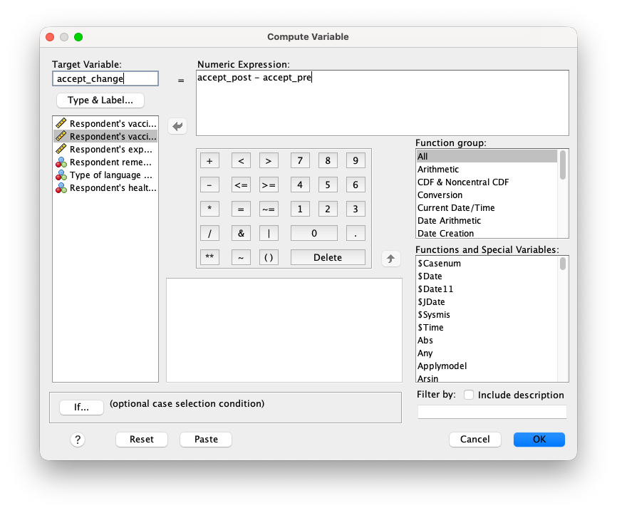
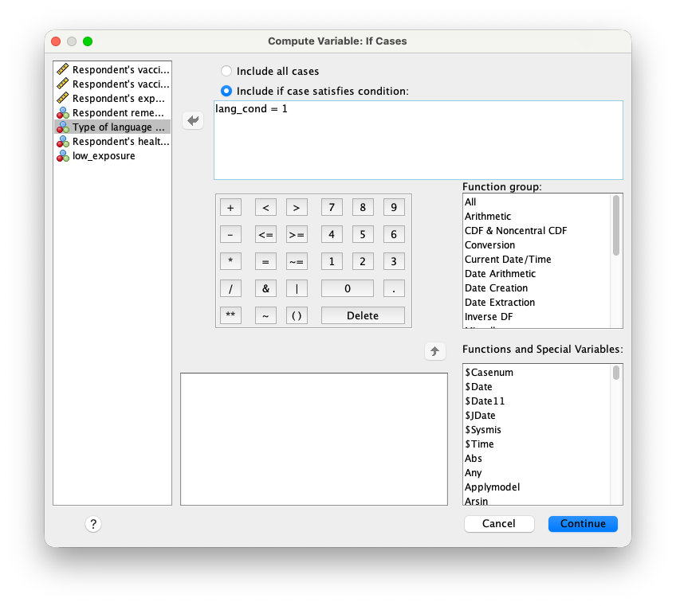

This book offers a non-technical but thorough introduction to statistical inference. It discusses a minimal set of concepts needed to understand both the possibilities and pitfalls of estimation, null hypothesis testing, moderation, and mediation analysis. It uses a minimum of formal notation.

## Intended Audience and Setting {.unnumbered}

This book is written as reading material for a follow-up course in statistics, in the bachelor of Communication Science at the University of Amsterdam. Students enrolled in this course have passed an introductory course in statistics that explained how to change research questions into variables and associations between variables, how to select and execute the correct analysis or test (in SPSS) to answer their research question, and how to interpret the results in a language that is both comprehensible for the average reader and complying with professional standards (APA standard for reporting test results). In addition, they have learned the very basics of inferential statistics: How to decide which null hypothesis to reject based on reported _p_ values, and how to interpret confidence intervals.  

## Interactive Content {.unnumbered}

The interactive content in this book replaces simulations that used to be demonstrated during lectures. We expect that doing simulations yourself rather than watching them being done by someone else enhances understanding. We have tried to break down the simulations into smaller steps, confronting the student several times with essentially the same simulation, but with added complexity. We hope that this approach enhances understanding and remembrance and, at the same time, avoids frustration caused by complex dashboards offering all options at once.

## Software {.unnumbered}

This book is specificly written for students who have access to SPSS, but the concepts and techniques are applicable to any software that can do the analyses described in this book. We have included screenshots of SPSS output, but We have tried to keep the interpretation of the output as general as possible. The interactive content is implemented in R, but it is not necessary to understand R code to understand the concepts and techniques presented in this book. 

# SPSS data wrangling and visualization {#wrangling}

This chapter covers the basics of data wrangling and visualization in SPSS. It explains how to import data, clean and prepare it for analysis, and perform basic transformations and visualizations. We will cover topics such as handling missing data, recoding variables, and creating new variables, data selection and filtering. The goal is to ensure that you are comfortable with the data preparation process before moving on to more advanced statistical analyses. We will cover these topics in a practical, hands-on manner, with examples and exercises that are structured along a selected set of functions in SPSS.

For this chapter we will be working with the [vaccine.sav](data/vaccine.sav) dataset, which contains fictitiousdata on a sample of 143 participants who were surveyed about their attitudes towards vaccination. @tbl-description provides a description of the variables in the dataset.

Table: Description of the variables {#tbl-description}

Variable        | Description
:---------------|:------------------------------------------------
accept_post     | Respondent's vaccine acceptance at the campaign end
accept_pre      | Respondent's vaccine acceptance at the campaign start
exposure        | Respondent's exposure to the campaign
remember        | Respondent remembers the campaign?
lang_cond       | Type of language used in the campaign
health_literacy | Respondent's health literacy

The dataset describes a health communication study investigating which campaign strategy is most effective in increasing acceptance of a new vaccine. Researchers developed three versions of a campaign: one using autonomy-supportive language that respects people’s freedom of choice, one using controlling language that pressures or threatens people to accept the vaccine, and one using neutral language that serves as a control condition. They hypothesize that the effectiveness of these strategies may depend on individuals’ health literacy, defined as their ability to find, understand, and use health information to make good health decisions. To test this, participants with either high or low health literacy were randomly assigned to view one of the three campaign versions, and their vaccine acceptance was measured as the main outcome. In addition to vaccine acceptance, the dataset contains information on participants’ exposure to the campaign, whether they remember it, and their health literacy level.

## Compute variable

The first function we wil be covering is the `Transform > Compute Variable...` function. This function allows you to create new variables based on existing ones, perform mathematical operations, and apply conditional logic. For example, you can use the `compute` function to calculate the difference between the post and pre-campaign vaccine acceptance scores.

::: {#fig-compute layout-ncol=2}

{#fig-compute-left cap="The Compute Variable dialog box in SPSS." width=400 fig-align="left"}

{#fig-compute-right cap="The Conditional Logic dialog box in SPSS." width=400 fig-align="left"}

The Compute Variable dialog box in SPSS.
:::

As you can see in @fig-compute-left, the Compute Variable dialog box allows you to specify the `Target Variable` name, the numeric expression for the new variable, or any conditional logic that may apply. In this case, we will create a new variable called `accept_change` that represents the change in vaccine acceptance from pre- to post-campaign. The numeric expression for this variable will be `accept_post - accept_pre`. Or calculate the average acceptance score by using one of the built-in functions, such as `MEAN(accept_post, accept_pre)`. 

You can also use conditional logic to create a new variable based on specific criteria. For example, you could create a new variable called `low_exposure` that indicates whether a participant's post-campaign acceptance score is above a certain threshold (e.g., 4 on a 10-point scale). The numeric expression for this variable would be `exposure < 4`.

Or you can set specific values for a variable based on conditions. For example, if you would need to make dummy variables for the three campaign conditions, you could make a new variable called `lang_supportive_dummy` and set it to 1 for participants in the autonomy-supportive condition by setting the `Numeric Expression` to `1`, and use the `if` dialog box to specify the condition `lang_cond = 1` as shown in @fig-compute-right. You would repeat this process for the controlling condition by creating `lang_controlling_dummy` variables. Or beter yet, you could do only the first step and modify the syntax to create the other dummy variables in one go. The syntax for this would look like this:

```{}
IF  (lang_cond = 1) lang_supportive=1.
IF  (lang_cond = 2) lang_controlling=1.
EXECUTE.
```
## Recode

## Visual binning

## Merge files

## Split files

## Select cases

## Chart builder

## Matrix scatter plot

## Panel histogram


