# Introduction {.unnumbered}

This book offers a non-technical but thorough introduction to statistical inference. It discusses a minimal set of concepts needed to understand both the possibilities and pitfalls of estimation, null hypothesis testing, moderation, and mediation analysis. It uses a minimum of formal notation.

## Intended Audience and Setting

This book is written as reading material for a follow-up course in statistics, in the bachelor of Communication Science at the University of Amsterdam. Students enrolled in this course have passed an introductory course in statistics that explained how to change research questions into variables and associations between variables, how to select and execute the correct analysis or test (in SPSS) to answer their research question, and how to interpret the results in a language that is both comprehensible for the average reader and complying with professional standards (APA standard for reporting test results). In addition, they have learned the very basics of inferential statistics: How to decide which null hypothesis to reject based on reported _p_ values, and how to interpret confidence intervals.  

## Interactive Content

The interactive content in this book replaces simulations that used to be demonstrated during lectures. We expect that doing simulations yourself rather than watching them being done by someone else enhances understanding. We have tried to break down the simulations into smaller steps, confronting the student several times with essentially the same simulation, but with added complexity. We hope that this approach enhances understanding and remembrance and, at the same time, avoids frustration caused by complex dashboards offering all options at once.

## Software

This book is specificly written for students who have access to SPSS, but the concepts and techniques are applicable to any software that can do the analyses described in this book. We have included screenshots of SPSS output, but We have tried to keep the interpretation of the output as general as possible. The interactive content is implemented in R, but it is not necessary to understand R code to understand the concepts and techniques presented in this book. 

# SPSS basics {.unnumbered}

This chapter covers the basics of data wrangling and visualization in SPSS. It explains how to import data, clean and prepare it for analysis, and perform basic transformations and visualizations. We will cover topics such as handling missing data, recoding variables, and creating new variables, data selection and filtering. The goal is to ensure that you are comfortable with the data preparation process before moving on to more advanced statistical analyses. We will cover these topics in a practical, hands-on manner, with examples and exercises that are structured along a selected set of functions in SPSS.

## Syntax

While using SPSS it is good practice to keep a record of the steps you take in your analysis. This can be done by saving the syntax of your commands, which allows you to reproduce your analysis later or share it with others. Producing clear and well-documented syntax is an important skill in data analysis, as it allows for transparency and reproducibility of your work. In SPSS you can produce syntax by clicking on the `Paste` button in the dialog boxes of the functions you use. This will paste the corresponding syntax into a syntax window, which you can then save and run later. You can also edit the syntax directly in the syntax window, which allows for more flexibility and customization of your analysis. It is good practice to properly comment your syntax, so that you and others can understand what each step of the analysis does. You can add comments in SPSS syntax by using an asterisk (*) at the beginning of a line.

```{.default code-line-numbers="true"}
* Specify the data set to use for this analysis
* Recode the variable remember to system missing if it is 0

DATASET ACTIVATE DataSet1.
RECODE remember (0=SYSMIS) INTO only_remember.
EXECUTE.
```
Above you can see an example of a syntax with comments. The first two lines are comments that explain what the following lines of syntax do. Line 3 is deliberately left blank to separate the comments from the actual syntax. This is relevant because SPSS _sometimes_ does not execute the syntax correctly if there is no separation between comments and syntax. The fourth line specifies the dataset to use for the analysis, and the fifth line recodes the variable `remember` to system missing if it is 0, creating a new variable called `only_remember`. The last line executes the recoding command.

The syntax file can be saved as a `.sps` file, which can be opened and run in SPSS at any time.

## Example dataset

For this chapter we will be working with the [vaccine.sav](data/vaccine_1.sav) dataset, which contains fictitious data on a sample of 143 participants who were surveyed about their attitudes towards vaccination. @tbl-description provides a description of the variables in the dataset.

Table: Description of the variables {#tbl-description}

Variable        | Description
:---------------|:------------------------------------------------
id              | Unique identifier for each participant
accept_post     | Respondent's vaccine acceptance at the campaign end
accept_pre      | Respondent's vaccine acceptance at the campaign start
exposure        | Respondent's exposure to the campaign
remember        | Respondent remembers the campaign?
lang_cond       | Type of language used in the campaign
health_literacy | Respondent's health literacy

The dataset describes a health communication study investigating which campaign strategy is most effective in increasing acceptance of a new vaccine. Researchers developed three versions of a campaign: one using autonomy-supportive language that respects people’s freedom of choice, one using controlling language that pressures or threatens people to accept the vaccine, and one using neutral language that serves as a control condition. They hypothesize that the effectiveness of these strategies may depend on individuals’ health literacy, defined as their ability to find, understand, and use health information to make good health decisions. To test this, participants with either high or low health literacy were randomly assigned to view one of the three campaign versions, and their vaccine acceptance was measured as the main outcome. In addition to vaccine acceptance, the dataset contains information on participants’ exposure to the campaign, whether they remember it, and their health literacy level.

## Data wrangling {#wrangling}

In communication science, data wrangling is the process of cleaning and transforming raw data into a format that is suitable for analysis. This process often involves several steps, including importing data, handling missing values, recoding variables, creating new variables, and filtering or selecting cases. In this chapter, we will cover these steps in detail, using the vaccine dataset as an example.

### Compute variable

The first function we wil be covering is the `Transform > Compute Variable...` function. This function allows you to create new variables based on existing ones, perform mathematical operations, and apply conditional logic. For example, you can use the `compute` function to calculate the difference between the post and pre-campaign vaccine acceptance scores.

::: {#fig-compute layout-ncol=2}

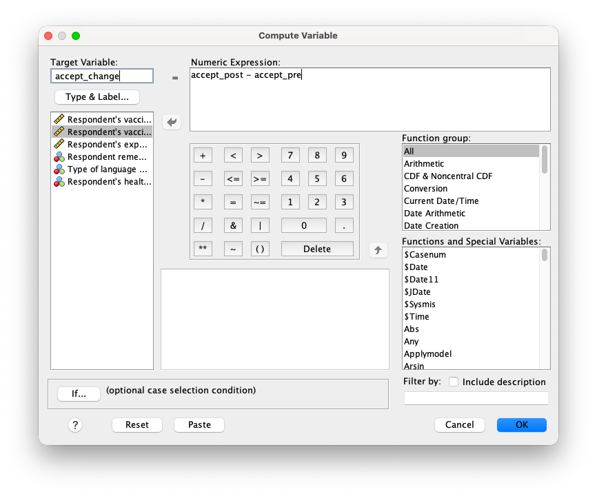{#fig-compute-left cap="The Compute Variable dialog box in SPSS." width=400 fig-align="left" .lightbox}

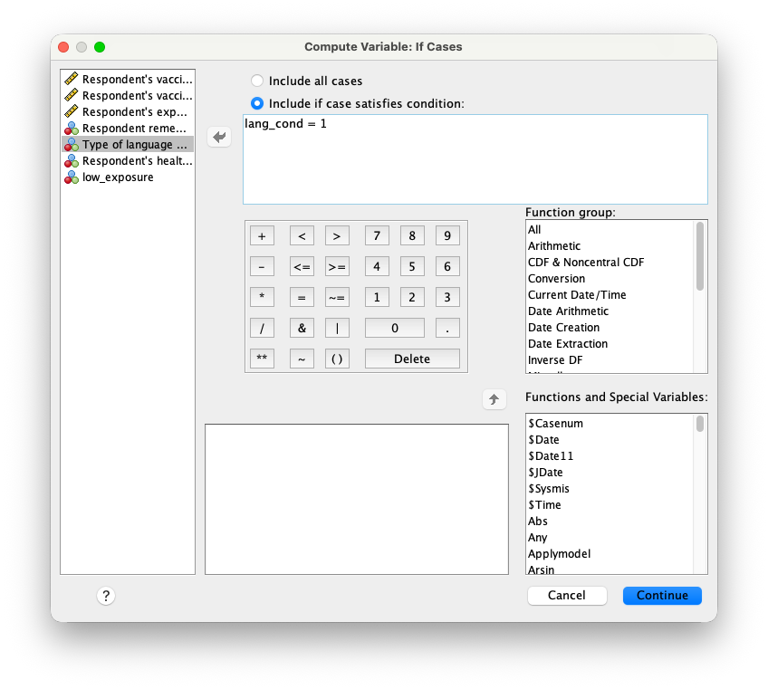{#fig-compute-right cap="The Conditional Logic dialog box in SPSS." width=400 fig-align="left" .lightbox}

The Compute Variable dialog box in SPSS.
:::

As you can see in @fig-compute-left, the Compute Variable dialog box allows you to specify the `Target Variable` name, the numeric expression for the new variable, or any conditional logic that may apply. In this case, we will create a new variable called `accept_change` that represents the change in vaccine acceptance from pre- to post-campaign. The numeric expression for this variable will be `accept_post - accept_pre`. Or calculate the average acceptance score by using one of the built-in functions, such as `MEAN(accept_post, accept_pre)`. 

You can also use conditional logic to create a new variable based on specific criteria. For example, you could create a new variable called `low_exposure` that indicates whether a participant's post-campaign acceptance score is above a certain threshold (e.g., 4 on a 10-point scale). The numeric expression for this variable would be `exposure < 4`.

Or you can set specific values for a variable based on conditions. For example, if you would need to make dummy variables for the three campaign conditions, you could make a new variable called `lang_supportive_dummy` and set it to 1 for participants in the autonomy-supportive condition by setting the `Numeric Expression` to `1`, and use the `if` dialog box to specify the condition `lang_cond = 1` as shown in @fig-compute-right. You would repeat this process for the controlling condition by creating `lang_controlling_dummy` variables. Or beter yet, you could do only the first step and modify the syntax to create the other dummy variables in one go. The syntax for this would look like this:

```default
IF  (lang_cond = 1) lang_supportive  = 1.
IF  (lang_cond = 2) lang_controlling = 1.
EXECUTE.
```

In communication science the compute funciont is often used to combine seperate questionaire items into a single scale score. For example, if you have a 5-item scale measuring vaccine acceptance, you could use the `MEAN` of `SUM` function to calculate the new scale score across those items and create a new variable called `acceptance_scale`. This new variable can then be used in subsequent analyses.

### Recode

The `Transform > Recode into Different Variables...` function allows you to recode existing variables into new ones, which can be useful for creating categorical variables or grouping continuous variables into categories. For example, you could recode the `health_literacy` variable into a new variable called `health_literacy_group`, where participants with scores below a certain threshold are classified as "low" and those above the threshold as "high". 

The function is also often used for recoding indicative and contra indicative items in a scale. For example if you would have a single item of a scale that is, in contrast to all the other items, frazed in a negative way, you could recode the item so that it's score is reversed, and the interpretation of the item aligns with the other items.

The recode function lets you specify old and new values for the variable, and you can also use conditional logic to recode values based on specific criteria. In @fig-recode-left you can see the Recode Variable dialog box, where you can specify the input variable and specify the output variable. Under output variable, you can specify the name and label for the new variable. Make sure to click the `Change` button to save the output variable settings before proceeding.

Next you can specify the old and new values for the recoding process by clicking the `Old and New Values...` button, which opens the Old and New Values dialog box as shown in @fig-recode-right. In this dialog box, you can specify the old values and the corresponding new values for the recoding process. You can use the `Range` option to recode a range of values into a single category. For example, you could recode all values from 1 to 3 as "low" and all values from 4 to 5 as "high". In @fig-recode-right though, we will be recoding everyone that did not remember the campaign that they were exposed to as system missing.

::: {#fig-recode layout-ncol=2}

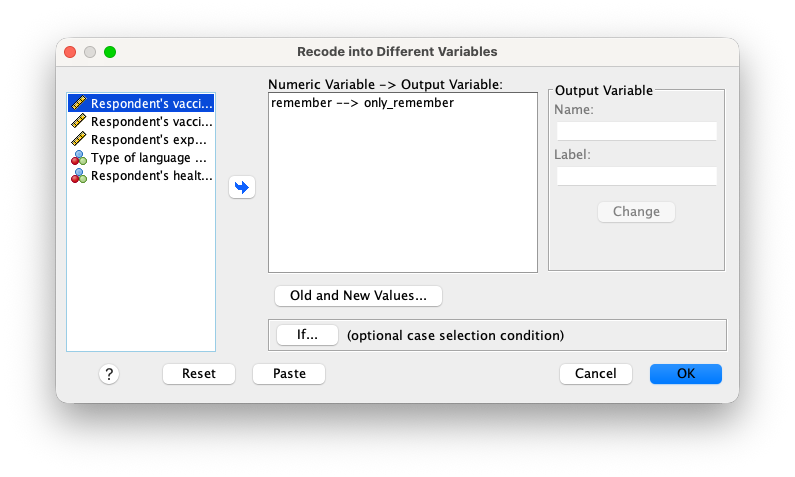{#fig-recode-left cap="The Recode Variable dialog box in SPSS." width=400 fig-align="left" .lightbox}

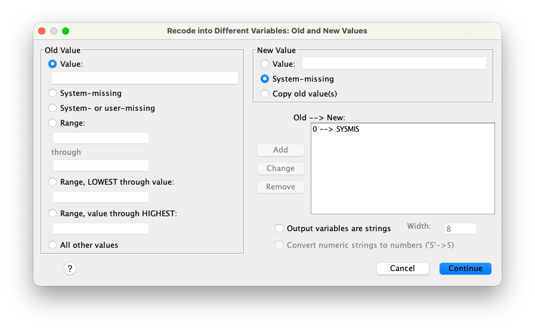{#fig-recode-right cap="The Old and New Values dialog box in SPSS." width=400 fig-align="left" .lightbox}

The Recode Variable dialog box in SPSS.
:::

There is also a `Transform > Recode into Same Variables...` function, which allows you to recode existing variables in place, without creating new variables. This can be useful for correcting errors or standardizing values within a variable. However, it is important to use this function with caution, as it will overwrite the original variable and its values.

### Visual binning

The `Transform > Visual Binning...` function allows you to create categorical variables from continuous variables by specifying cut points or ranges. This can be useful for creating groups or categories based on a continuous variable. We could for example use the Visual Binning function to create a new variable called `exposure_group` to categorize participants into low, medium, and high exposure groups based on their exposure scores. Specifying two cut points by equal percentiles would create three groups: low exposure (0-33rd percentile), medium exposure (34th-66th percentile), and high exposure (67th-100th percentile). In such cases SPSS will automatically create a new variable with the specified cut points and assign the appropriate group labels to each participant based on their exposure scores.

::: {#fig-binning layout-ncol=2}

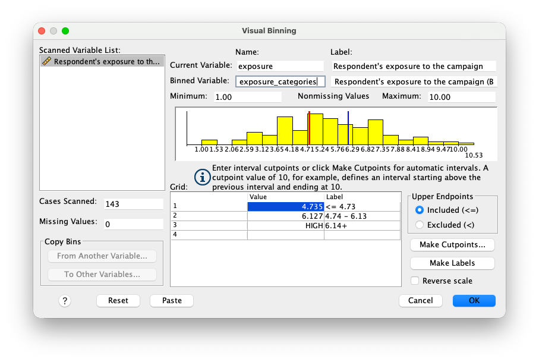{#fig-binning-left cap="The Visual Binning dialog box in SPSS." width=400 fig-align="left" .lightbox}

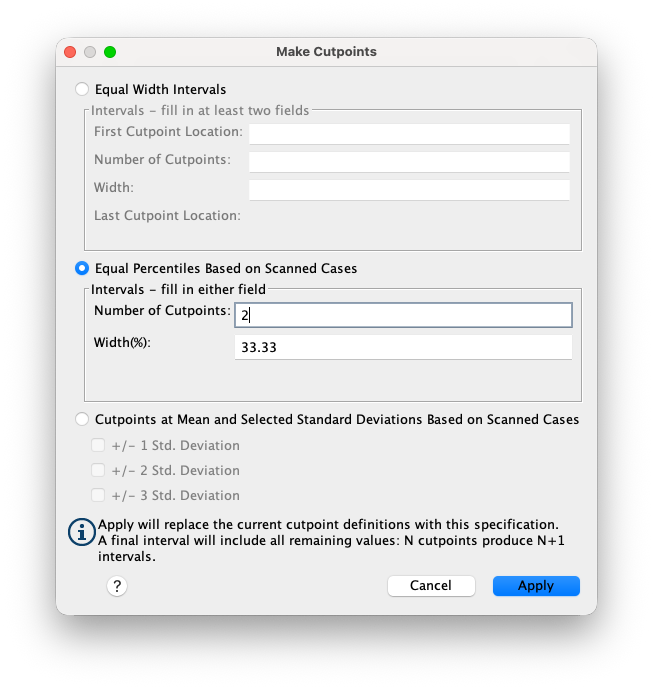{#fig-binning-right cap="Using the set cut points based on percentiles" width=400 fig-align="left" .lightbox}

The Visual Binning dialog box in SPSS.
:::

In the Visual Binning dialog box in @fig-binning-left, you can specify the input variable and the output variable name and label. You can use the `Make Cutpoints` button to specify the cut points for the new variable. In @fig-binning-right, you can see how to set the cut points based on percentiles. You can also specify the labels for each group in the `Value Labels` section of the dialog box.

### Merge files

While doing research it is often necessary to combine data from multiple sources or datasets. The `Data > Merge Files > Add Variables...` function in SPSS allows you to merge two or more datasets based on a common identifier or key variable. This can be useful for combining data from different time points, different studies, or different sources. A key variable is a variable in your dataset that uniquely identifies each case or participant. For example, if you have two datasets containing information about the same participants, you could use a unique participant ID as the key variable to merge the datasets together. A studentnumber is a good example of a key variable, as it uniquely identifies each student in the university's database. When merging datasets, it is important to ensure that the key variable is consistent across all datasets and that there are no duplicate or missing values.

The dataset [Vaccine_age.sav](data/vaccine_age.sav) contains the same unique `id` variable as the `vaccine.sav` dataset, and it also contains the participants' age. We can use the `Data > Merge Files > Add Variables...` function to merge these two datasets. You first need to specify the location of the second dataset, as shown in @fig-add-variables-left, and then select the key variable to match cases between the two datasets as shown in @fig-add-variables-right. In this case, we will use the `id` variable as the key variable to merge the datasets. After merging, you will have a new dataset that contains all the variables from both datasets, with each case matched based on the `id` variable.

::: {#fig-merge-var layout-ncol=2}

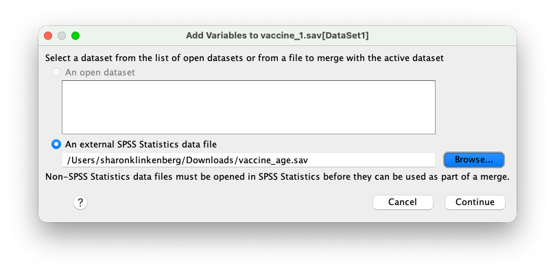{#fig-add-variables-left width=400 fig-align="left" .lightbox}

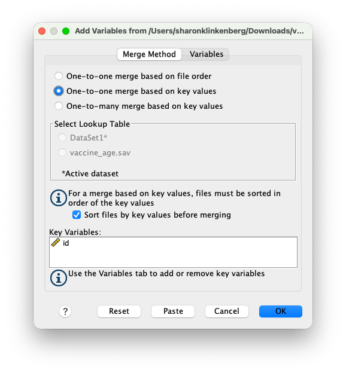{#fig-add-variables-right width=400 fig-align="left" .lightbox}

Adding variables from another dataset in SPSS.
:::

The `Data > Merge Files > Add Cases...` option allows you to combine datasets by adding cases (rows) from one dataset to another. This can be useful when you have multiple datasets with the same variables but different participants. When adding cases, it is important to ensure that the variables in both datasets are consistent and have the same names and formats.

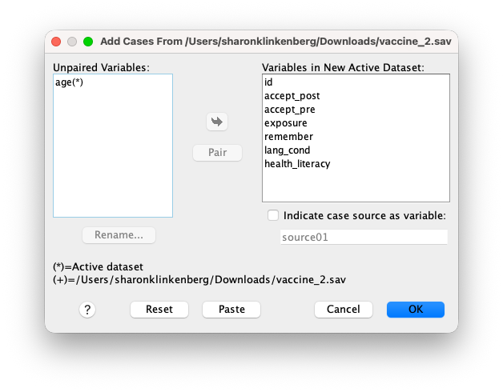{#fig-add-cases width=400 fig-align="left" .lightbox}

The dataset [vaccine_2.sav](data/vaccine_2.sav) contains an additional two participants with the same variables as the `vaccine.sav` dataset. We can use the `Data > Merge Files > Add Cases...` function to add these two cases to the original dataset. You first need to specify the location of the second dataset just like in @fig-add-variables-left, and then ensure that the variables in both datasets are consistent and have the same names and formats. After adding cases, you will have a new dataset that contains all the cases from both datasets, with each case matched based on the variable names. As can be seen in @fig-add-cases, SPSS suggest to leave out the variable `age` because it is not present in the `vaccine_2.sav` dataset. Though in some cases it could be useful to retain the age variable, and leave the values for the two new cases as system missing. In that case you would need to select `age` in the `Unpaired Variables` box and move it to the right box.

### Select cases

SPSS allows you to run analyses on a subset of your data by using the `Data > Select Cases...` function. This function allows you to specify criteria for selecting cases based on specific variables or conditions. For example, you could select only participants with high health literacy or only those who were exposed to the campaign. You can also use logical operators (e.g., AND, OR) to combine multiple criteria for case selection.

::: {#fig-select-cases layout-ncol=2}

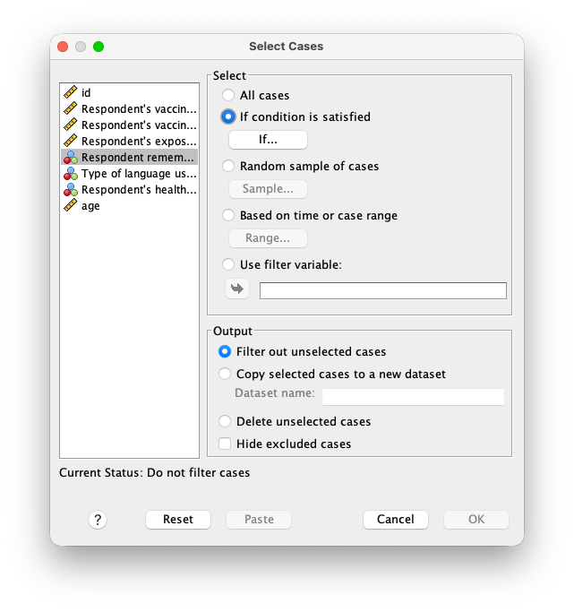{#fig-select-cases-left width=400 fig-align="left" .lightbox}

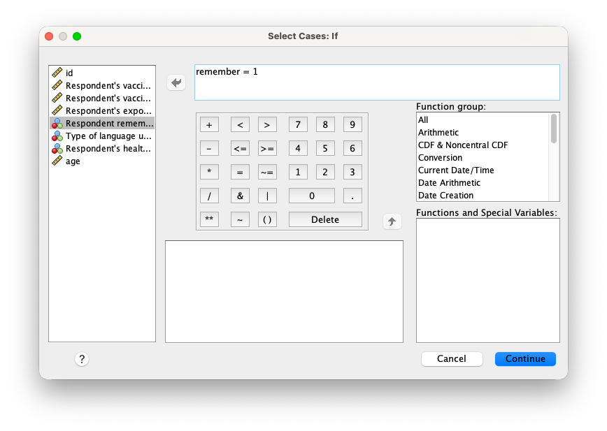{#fig-select-cases-right width=400 fig-align="left" .lightbox}

Selecting cases based on specific criteria in SPSS.
:::

We could decide to only run our subsequent analyses on participants who remember the campaign. In that case we would select `If condition is satisfied` and click on the `If...` button to specify the condition as shown in @fig-select-cases-left. In the dialog box that appears, you can move the variable `remember` to the expression box and specify the condition `remember = 1`, as shown in @fig-select-cases-right. You can see the result in the data view, where a new variable called `filter_$` is created, indicating which cases are selected (1) and which are not (0). The data view will also show a diagonal line through the unselected cases, indicating that they are excluded from the analysis. You can also choose to filter out unselected cases or delete them from the dataset entirely. Though it is generally recommended to filter out unselected cases rather than deleting them, as this allows you to retain the original dataset for future analyses and transparency. If you would like to continue analyzing all data again, the selection criteria should be removed by selecting `All cases` in the Select Cases dialog box.

### Split files

The final data wrangling function we will cover is the `Data > Split File...` function. This function allows you to split your dataset into separate groups based on a categorical variable, and run analyses separately for each group. For example, you could split the dataset by health literacy level (high vs. low) and run separate analyses for each group. This can be useful for exploring differences between groups or testing for interactions between variables.

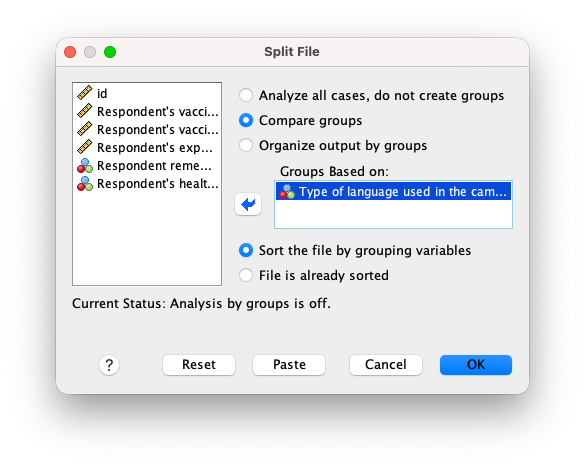{#fig-split-files width=400 fig-align="left" .lightbox}

@fig-split-files shows the Split File dialog box, where you can specify the grouping variable and the analysis options. You can choose to sort the data by the grouping variable or keep the original order of cases. You can also choose to display the results for each group in separate tables or combine them into a single table. If you want to continue analyzing all data again, the split file option should be removed by selecting `Analyze all cases, do not create groups` in the Split File dialog box.

## Visualization

Communication science often involves visualizing data to better understand patterns, relationships, and trends. SPSS provides a variety of visualization options, including bar charts, line graphs, scatter plots, and histograms. In this section, we will cover some of the basic visualization techniques in SPSS. Visualizing data is not only an inportant skill in communicating your research findings, but it is also an important step in the data analysis process. Visualizations can help you identify outliers, trends, and patterns in your data that may not be immediately apparent from summary statistics alone.

### Chart builder

The `Graphs > Chart Builder...` function in SPSS allows you to create a wide range of visualizations, including bar charts, line graphs, scatter plots, and histograms. The Chart Builder provides a drag-and-drop interface that makes it easy to create customized visualizations based on your data. You can specify the variables to be plotted, choose the chart type, and customize the appearance of the chart.

The interface allows you to drag and drop varibles from the variable list into the appropriate axes or chart elements. Depending on the specified measure of the variable (nominal, ordinal, or scale), SPSS will set the appropriate axis options. This also means that if the variable is not specified correctly in the variable view of the data file, the chart may not display the proper options.

::: {#fig-chart-builder layout-ncol=2}

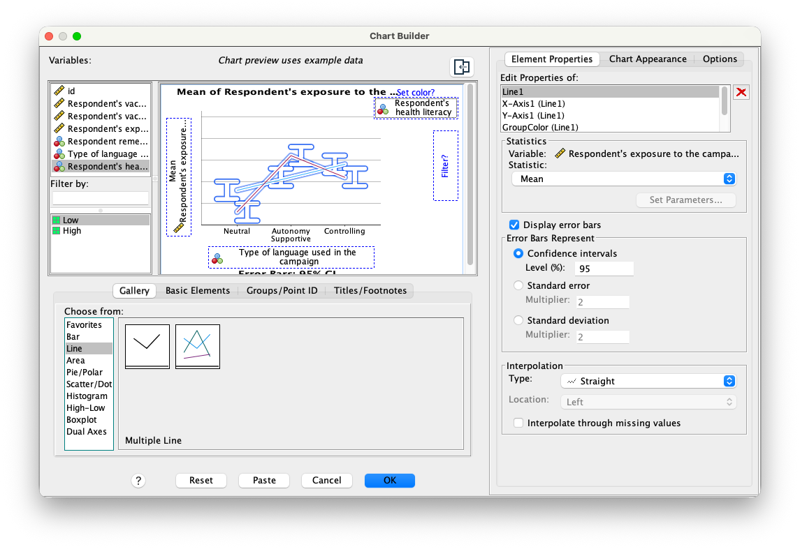{#fig-chart-builder-line width=400 fig-align="left" .lightbox}

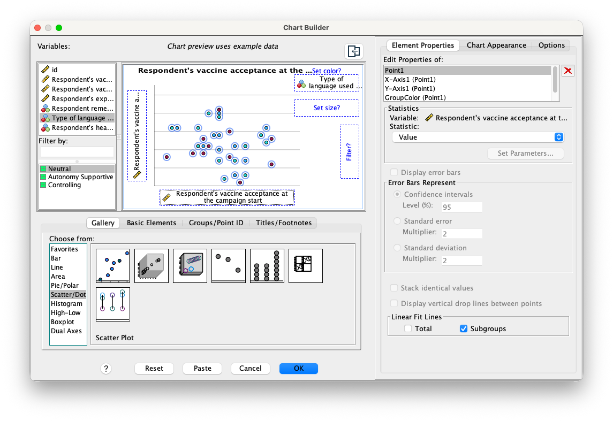{#fig-chart-builder-scatter width=400 fig-align="left" .lightbox}

SPSS Chart Builder dialog box, showing the options for creating a line chart and a scatter plot.
:::

In @fig-chart-builder-line we made a plot showing the average campaign exposure for each of the three campaign conditions, in combination with the health literacy level of the participants. By putting the campaign condition on the x-axis, and having the health literacy level as a separately colored line, we are visualizing the interaction between these two variables. Note that we also opted to show the confidence intervals around the means, which can be done by clicking on the `Element Properties` button in the Chart Builder dialog box and selecting the `Display error bars` option. One thing to notice is that the preview in the Chart Builder dialog box does not show the real data. Only after making the chart, the chart will be added to the SPSS output file.

In @fig-chart-builder-scatter we made a scatter plot showing the relationship between campaign exposure and post-campaign vaccine acceptance. By putting the exposure variable on the x-axis and the post-campaign acceptance variable on the y-axis and setting campaign condition as the grouping variable, we can visualize the association between these two variables for all campaign conditions. We also opted to add a regression line to the scatter plot, which can be done by clicking on the `Element Properties` button in the Chart Builder dialog box and selecting the `Point1` option from the `Edit Properties of:` list. at the bottom right of the dialog box, we can select `subgroups` in the `Linear Fit Lines` box. These regression lines will help to visualize the overall trend in the data and can provide insight into the strength and direction of the relationship between the two variables. From @fig-scatter-plot-1 it is evident that the regression lines ar parrallel, which suggests that there is no interaction between campaign condition and exposure in predicting post-campaign vaccine acceptance.

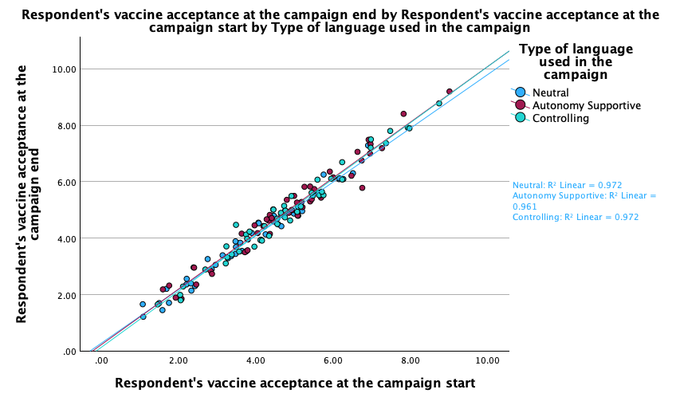{#fig-scatter-plot-1 width=400 fig-align="left" .lightbox .column-margin}

Under the `Element Properties`, `Chart Appearance` and `Chart Options` buttons, you can customize the appearance of the chart, including the colors, fonts, and labels. You can also change titles, legends, and axis labels. We recommend that you try out these options to see how they affect the appearance of the chart. You can also use the `Chart Editor` in the SPSS output file to make further customizations to the chart after it has been created.


### Matrix scatter plot

### Panel histogram


